# Xcode编译调试OpenJDK12

## 编译
下载brew然后安装hg，freetype，ccache
```bash
$ /usr/bin/ruby -e "$(curl -fsSL https://raw.githubusercontent.com/Homebrew/install/master/install)"
$ brew install ccache
$ brew install freetype
$ brew install hg
$ hg clone http://hg.openjdk.java.net/jdk/jdk12 openjdk12
$ cd openjdk12
$ chmod +x configure
$ ./configure --enable-ccache --witt-debug-level=server-fastdebug
$ make all #or make hotspot
```
一切完成后`openjdk12/build/macos-x86_64-server-fastdebug`就是编译产出。
然后cygwin打开，进入openjdk12目录输入命令进行编译：
```bash
$./configure --with-freetype-include=/your_path/freetype-2.9.1/src/include --with-freetype-lib=/your_path/freetype-2.9.1/lib --with-boot-jdk=/your_path/openjdk-12-x64_bin --disable-warnings-as-errors --with-toolchain-version=2017 --with-target-bits=64 --enable-debug'
$make all
```
编译完成后生成类似`openjdk12/build/windows-x86_64-server-fastdebug`的目录，里面`jdk/bin/java.exe`即hotspot。

## xcode调试
打开xcode创建一个项目，然后选择macOS，创建一个命令行项目：

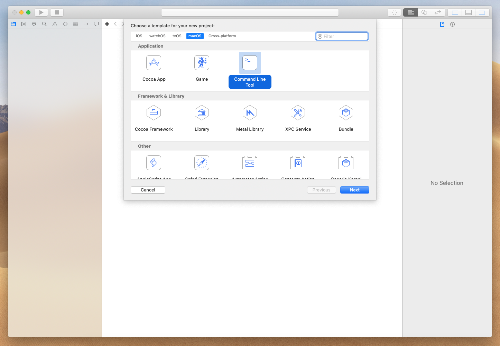

然后选中新项目自动创建的文件右键删除

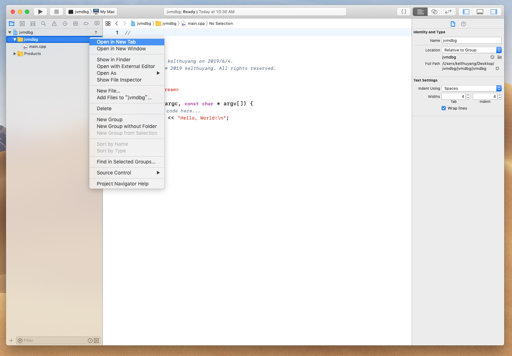

接着配置启动项。对着停止那个方块按钮旁边的按钮右键Edit Scheme

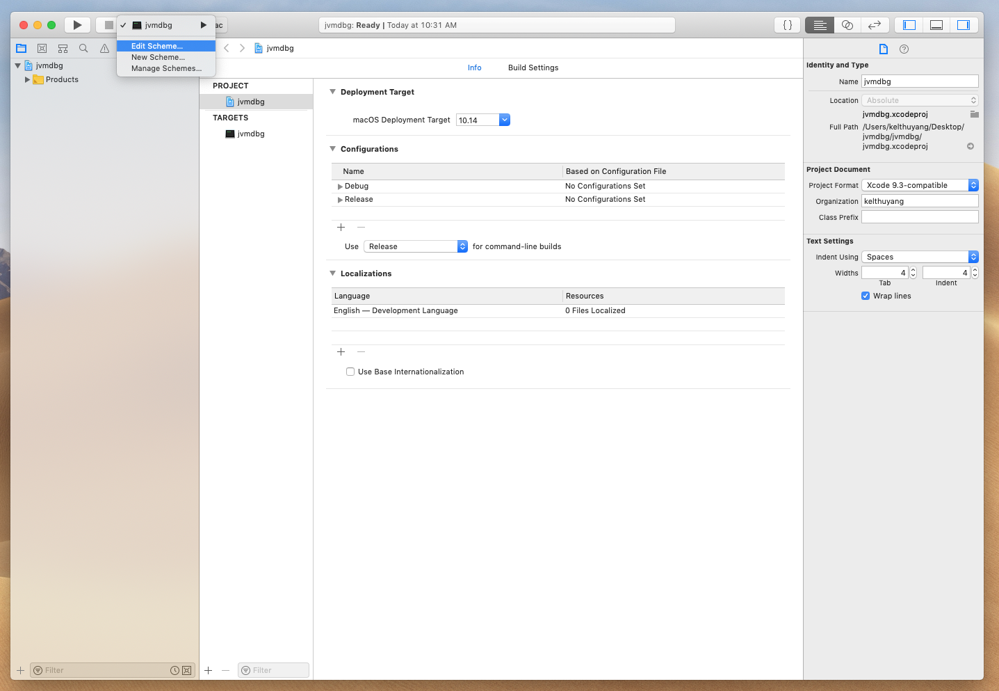

在运行里面选择basic configuration，选择other

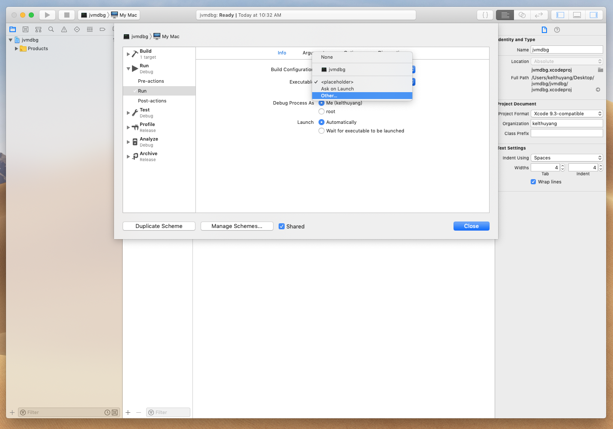

这里选择之前编译出来的jvm，比如我的目录是`/Users/kelthuyang/Desktop/openjdk12/build/macosx-x86_64-server-fastdebug/jdk/bin`

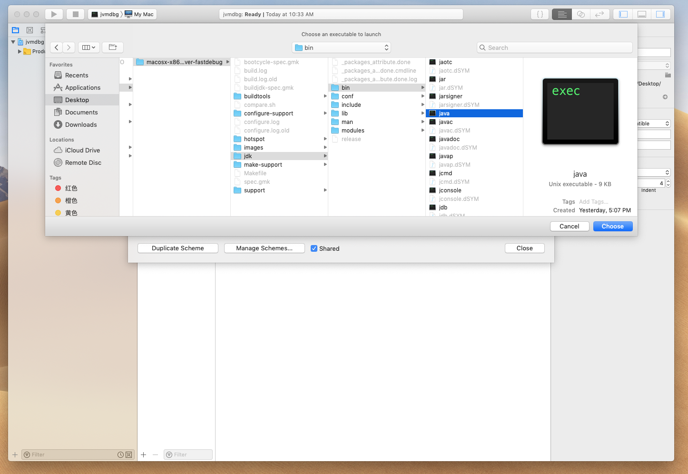

然后选择Argument给虚拟机加个启动参数，这里随便写个java hello world，然后javac编译得到字节码文件，`-cp` 指定字节码所在目录，后面加上类名

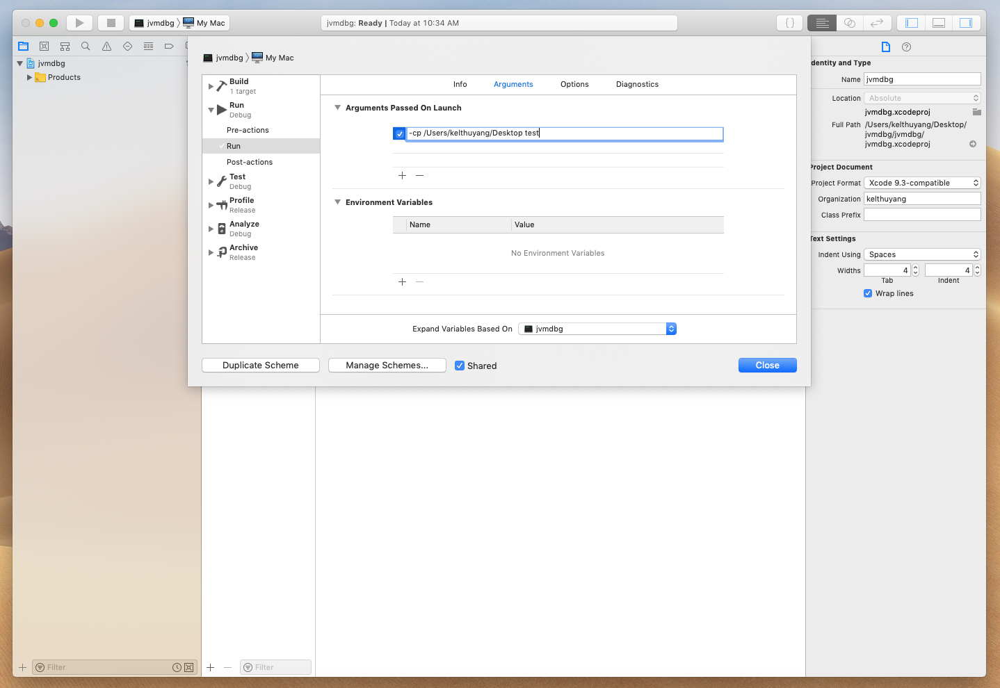

然后选中工程add files to project将hotspot源代码倒入到项目

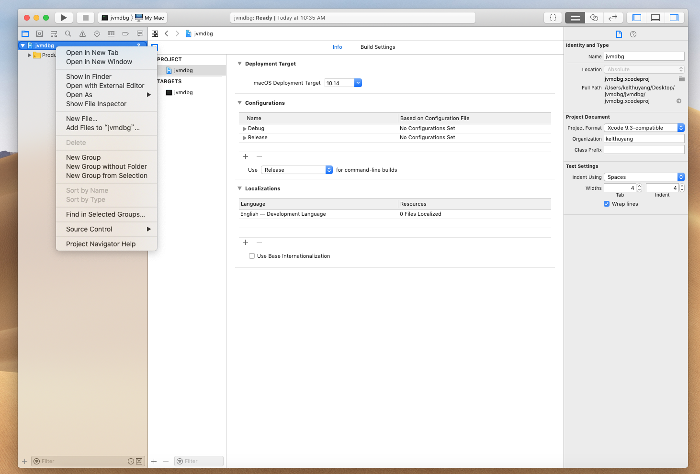

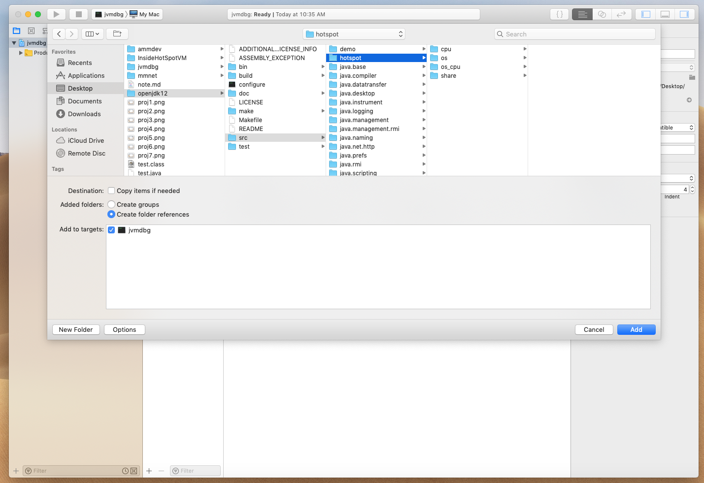


到这里已经可以运行了，直接运行会出现sigsegv信号，这是正常情况，但是会阻碍调试。可以在lldb中使用`process handle SIGSEGV -s false`

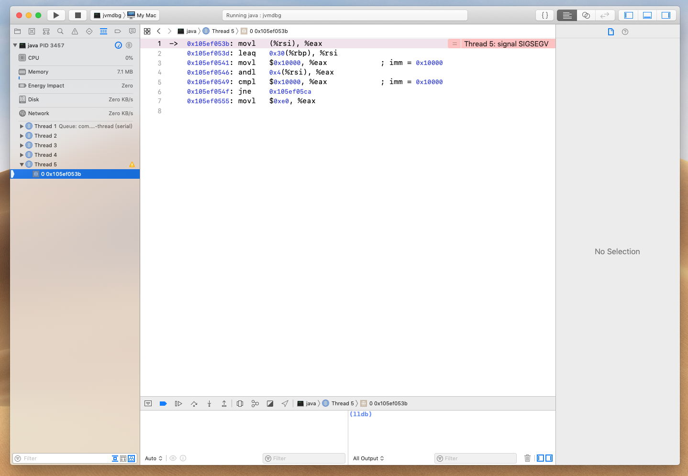

不过每次运行都需要输入比较麻烦，可以设置符号断点忽略sigsegv信号。选择左边创建那个箭头，然后最下面加号选择symbolic breakpoint

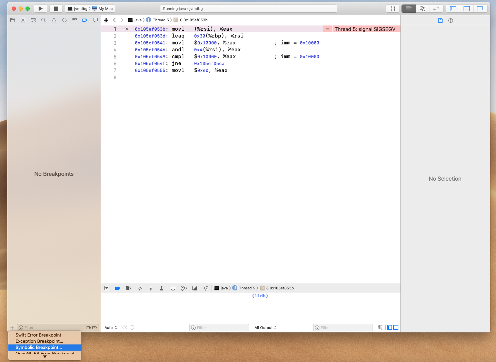

随便加一个，比如我加的是`Threads::create_vm`模块忽略sigsegv

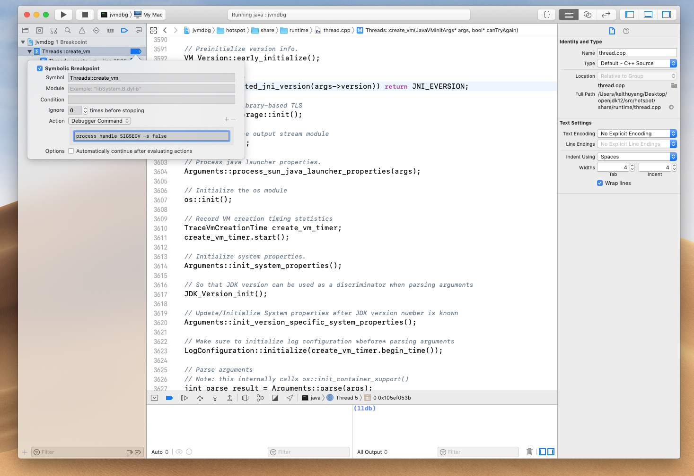

再次运行，一切顺利！

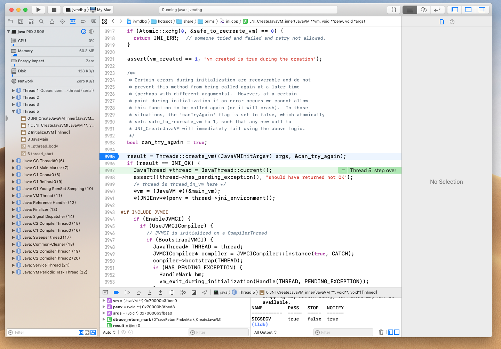