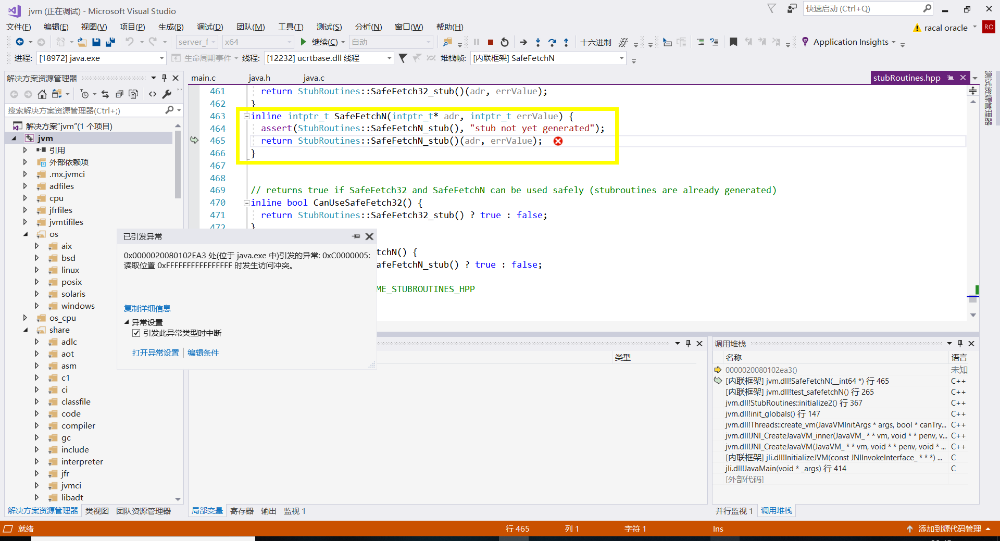

# Visual Studio2017编译调试OpenJDK12

## 编译
下载并编译好freetype，然后安装cygwin并安装必要工具：
+ autoconf
+ make
+ zip
+ unzip
当前目录效果为：

然后cygwin打开，进入openjdk12目录输入命令进行编译：
```bash
$./configure --with-freetype-include=/your_path/freetype-2.9.1/src/include --with-freetype-lib=/your_path/freetype-2.9.1/lib --with-boot-jdk=/your_path/openjdk-12-x64_bin --disable-warnings-as-errors --with-toolchain-version=2017 --with-target-bits=64 --enable-debug'
$make all
```
编译完成后生成类似`openjdk12/build/windows-x86_64-server-fastdebug`的目录，里面`jdk/bin/java.exe`即hotspot。

## vs2017调试
刚刚make all生成了exe，现在使用
```bash
$make hotspot-ide-project
```
生成vs工程文件，位于`openjdk12/build/windows-x86_64-server-fastdebug/ide/hotspot-visualstudio/jvm.vcproj`，双击打开载入即可，上方选择`server-fastdebug`即可开始调试。

## 其它
调试可能遇到`safefetch32`抛出异常，这是正常情况，该异常会被外部SEH捕获，直接继续调试就好。
