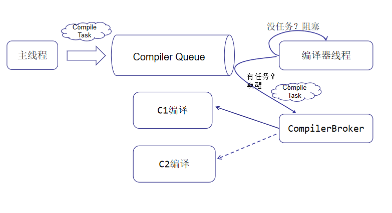
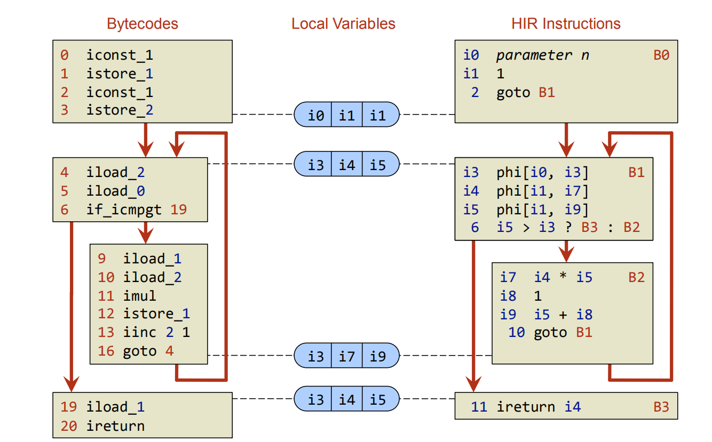
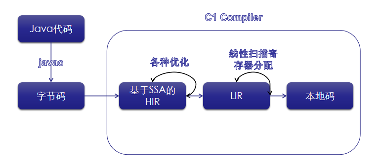
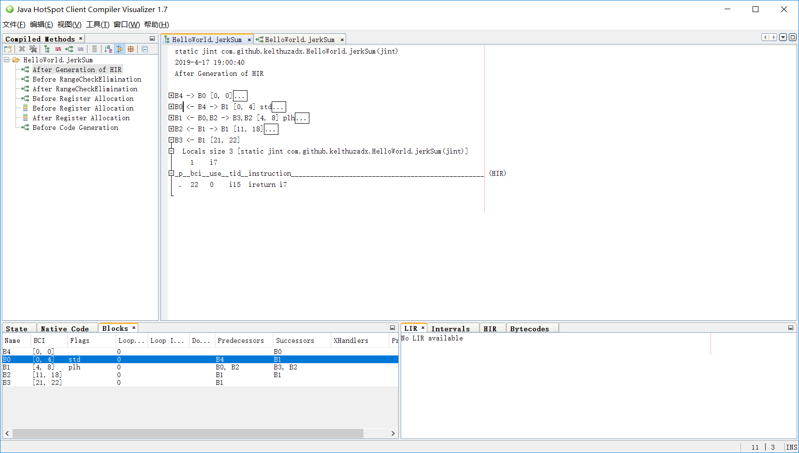
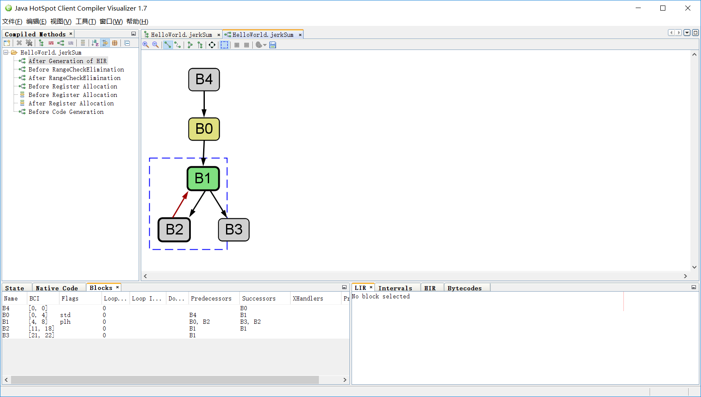

# [Inside HotSpot] C1编译器工作流程及中间表示

## 1. C1编译器线程
C1编译器(aka Client Compiler)的代码位于`hotspot\share\c1`。C1编译线程(C1 CompilerThread)会阻塞在任务队列，当发现队列有编译任务即可CompileTask的时候，线程唤醒然后调用CompilerBroker，CompilerBroker再进一步选择合适编译器，以此进入JIT编译器的世界。



CompilerBroker到C1编译器进行JIT编译的调用栈如下：
```bash
CompileBroker::invoke_compiler_on_method()
    -> Compiler::compile_method()
        -> Compilation::Compilation()
            -> Compilation::compile_method()
                -> Compilation::compile_java_method()
```
在compile_java_method()方法中完成了C1编译最主要的流程：
```cpp
int Compilation::compile_java_method() {
  if (BailoutOnExceptionHandlers) {
    if (method()->has_exception_handlers()) {
      bailout("linear scan can't handle exception handlers");
    }
  }

  if (is_profiling() && !method()->ensure_method_data()) {
    BAILOUT_("mdo allocation failed", no_frame_size);
  }
  // 构造HIR
  {
    PhaseTraceTime timeit(_t_buildIR);
    build_hir();
  }
  if (BailoutAfterHIR) {
    BAILOUT_("Bailing out because of -XX:+BailoutAfterHIR", no_frame_size);
  }
  // 构造LIR
  {
    PhaseTraceTime timeit(_t_emit_lir);

    _frame_map = new FrameMap(method(), hir()->number_of_locks(), MAX2(4, hir()->max_stack()));
    emit_lir();
  }
  CHECK_BAILOUT_(no_frame_size);
  // 生成机器代码
  {
    PhaseTraceTime timeit(_t_codeemit);
    return emit_code_body();
  }
}
```

## 2. 中间表示简介
C1编译器(Client Compiler)将字节码转化为**SSA-based HIR**(Single Static Assignment based High-Level Intermediate Representation)。HIR即高级中间表示，我们用Java写代码，编译得到字节码。但即便是字节码对于编译器优化来说也不太理想，编译器会使用一种更适合优化的形式来表征字节码。这个**更适合优化的形式**就是HIR，HIR又有很多，有些是图的形式，有些是线性的形式，
HotSpot C1使用的HIR是一种基于[SSA(静态单赋值形式)](https://en.wikipedia.org/wiki/Static_single_assignment_form)的图IR，它由基本块([Basic Block](https://en.wikipedia.org/wiki/Basic_block))构成一个控制流图结构([Control Flow Graph](https://en.wikipedia.org/wiki/Control_flow_graph))，基本块里面是SSA，直观表示如下：



图片来源于[Java HotSpot™ Client Compiler - Compiler Design Lab](http://compilers.cs.uni-saarland.de/ssasem/talks/Christian.Wimmer.pdf)。左边是Java字节码，右边是字节码在C1中的HIR表示，右边的块状结构就是基本块，基本块里面即SSA。
这句话里面名词有点多，我们试着来解释一下。基本块是指单一入口，单一出口的块，块中没有跳转代码。对照图片看，`4 5 6`行代码是一个基本块，中间没有跳转，由4进入块，出口6的if_icmpgt转移到另一个基本块。这样的构型可以高效的做控制流分析，是编译优化常用的一种IR。CFG即控制流图，是由基本块构成的图结构。那么SSA又是什么呢？SSA表示每次变量的赋值都会创建新的且独一无二的名称，举个例子：
```js
// 源码
int foo(){  
  int a = 6;
  a = 8;
  return a;

// SSA表示
foo:
a1 = 6
a2 = 8
return a2
```
这段代码里a最开始的赋值是多余的，如果用SSA表示这段代码，编译器很容易发现a1这个值在foo块中没有使用，直接优化为：
```js
foo:
a2 = 8
return a2
```
SSA还有很多好处，这里只是一个小的方面，有兴趣的可以阅读编译理论方面的书籍，入门推荐[《编译器设计》](https://book.douban.com/subject/20436488/)和[《编译原理》](https://book.douban.com/subject/3296317/)。

回到主题，我们常说的C1编译器优化大部分都是在HIR之上完成的。当优化完成之后它会将HIR转化为**LIR**(Low-Level Intermediate Representation)，LIR又是一种编译器内部用到的表示，这种表示消除了HIR中的PHI节点，然后使用[LSRA(Linear Scan Register Allocation，线性寄存器分配算法)]((http://www.christianwimmer.at/Publications/Wimmer04a/Wimmer04a.pdf))将虚拟寄存器映射到物理寄存器，最后再将LIR转化为CPU相关的机器码，完成JIT工作。


## 3. 构造HIR

### 3.1 HIR与优化
build_hir()不仅会构造出HIR，还会执行很多平台无关的代码优化。**代码优化**不用多讲，JVM给我们带来性能上的信心很大程度上都源于此，这是评判JIT编译器的重要指标，也是编译器后端的主要任务。
```cpp
void Compilation::build_hir() {
  CHECK_BAILOUT();

  // 创建HIR
  CompileLog* log = this->log();
  if (log != NULL) {
    log->begin_head("parse method='%d' ",
                    log->identify(_method));
    log->stamp();
    log->end_head();
  }
  {
    PhaseTraceTime timeit(_t_hir_parse);
    _hir = new IR(this, method(), osr_bci());
  }
  if (log)  log->done("parse");
  if (!_hir->is_valid()) {
    bailout("invalid parsing");
    return;
  }

#ifndef PRODUCT
  if (PrintCFGToFile) {
    CFGPrinter::print_cfg(_hir, "After Generation of HIR", true, false);
  }
#endif

#ifndef PRODUCT
  if (PrintCFG || PrintCFG0) { tty->print_cr("CFG after parsing"); _hir->print(true); }
  if (PrintIR  || PrintIR0 ) { tty->print_cr("IR after parsing"); _hir->print(false); }
#endif
  
  // 验证HIR
  _hir->verify();
  
  // 优化：条件表达式消除，基本块消除
  if (UseC1Optimizations) {
    NEEDS_CLEANUP
    // optimization
    PhaseTraceTime timeit(_t_optimize_blocks);

    _hir->optimize_blocks();
  }

  _hir->verify();

  _hir->split_critical_edges();

#ifndef PRODUCT
  if (PrintCFG || PrintCFG1) { tty->print_cr("CFG after optimizations"); _hir->print(true); }
  if (PrintIR  || PrintIR1 ) { tty->print_cr("IR after optimizations"); _hir->print(false); }
#endif

  _hir->verify();

  // compute block ordering for code generation
  // the control flow must not be changed from here on
  _hir->compute_code();

  // 优化：全局值编号优化
  if (UseGlobalValueNumbering) {
    // No resource mark here! LoopInvariantCodeMotion can allocate ValueStack objects.
    PhaseTraceTime timeit(_t_gvn);
    int instructions = Instruction::number_of_instructions();
    GlobalValueNumbering gvn(_hir);
    assert(instructions == Instruction::number_of_instructions(),
           "shouldn't have created an instructions");
  }

  _hir->verify();

#ifndef PRODUCT
  if (PrintCFGToFile) {
    CFGPrinter::print_cfg(_hir, "Before RangeCheckElimination", true, false);
  }
#endif

  // 优化：范围检查消除
  if (RangeCheckElimination) {
    if (_hir->osr_entry() == NULL) {
      PhaseTraceTime timeit(_t_rangeCheckElimination);
      RangeCheckElimination::eliminate(_hir);
    }
  }

#ifndef PRODUCT
  if (PrintCFGToFile) {
    CFGPrinter::print_cfg(_hir, "After RangeCheckElimination", true, false);
  }
#endif

  // 优化：null检查消除
  if (UseC1Optimizations) {
    // loop invariant code motion reorders instructions and range
    // check elimination adds new instructions so do null check
    // elimination after.
    NEEDS_CLEANUP
    // optimization
    PhaseTraceTime timeit(_t_optimize_null_checks);

    _hir->eliminate_null_checks();
  }

  _hir->verify();

  // compute use counts after global value numbering
  _hir->compute_use_counts();

#ifndef PRODUCT
  if (PrintCFG || PrintCFG2) { tty->print_cr("CFG before code generation"); _hir->code()->print(true); }
  if (PrintIR  || PrintIR2 ) { tty->print_cr("IR before code generation"); _hir->code()->print(false, true); }
#endif

  _hir->verify();
}
```
build_hir()第一阶段解析字节码生成HIR；对其进行条件表达式消除，基本块消除；
接着使用全局值编号(GVN，Global Value Numbering)；
第二阶段[消除一些数组范围检查(Range Check Elimination)]((http://www.ssw.uni-linz.ac.at/Research/Papers/Wuerthinger07/Wuerthinger07.pdf))；最后做NULL检查消除（OpenJDK12版本的C1没有逃逸分析！不要听网上乱说）。另外要注意，如果开启了分层编译(TieredCompilation)，那么条件表达式消除和基本块消除只会发生在Tier1，Tier2层。

### 3.2 查看各阶段的HIR
如果JVM是`fastdebug`版，加上`-XX:+PrintIR`参数可以输出每一个步骤的HIR：
（我使用的完整参数是：`-XX:+UnlockDiagnosticVMOptions -XX:+PrintCompilation -XX:CompileCommand=compileonly,com.github.kelthuzadx.HelloWorld::jerkSum -Xcomp -XX:TieredStopAtLevel=1 -XX:+PrintIR -XX:+PauseAtExit`）
```js
  17669   28    b  1       com.github.kelthuzadx.HelloWorld::jerkSum (23 bytes)
IR after parsing
B4 [0, 0] -&gt; B0 sux: B0
empty stack
inlining depth 0
__bci__use__tid____instr____________________________________
. 0    0     17    std entry B0

B0 (SV) [0, 4] -&gt; B1 sux: B1 pred: B4
empty stack
inlining depth 0
__bci__use__tid____instr____________________________________
  2    0    i5     0
. 4    0     6     goto B1

B1 (LHV) [4, 8] -&gt; B3 B2 sux: B3 B2 pred: B0 B2
Locals:
1  i7 [ i4 i11] 
2  i8 [ i5 i13] 


empty stack
inlining depth 0
__bci__use__tid____instr____________________________________
  5    0    i9     10000
. 8    0     10    if i8 &gt;= i9 then B3 else B2

B2 (V) [11, 18] -&gt; B1 sux: B1 pred: B1
empty stack
inlining depth 0
__bci__use__tid____instr____________________________________
  13   0    i11    i7 + i8
  15   0    i12    1
  15   0    i13    i8 + i12
. 18   0     14    goto B1 (safepoint)

B3 (V) [21, 22] pred: B1
empty stack
inlining depth 0
__bci__use__tid____instr____________________________________
. 22   0    i15    ireturn i7

....
```

另外加上`-XX:+PrintCFGToFile`标志在字节码文件同目录下得到一个`output_xx.cfg`文件，里面的`begin_block`和`end_block`表示一个基本块；`predecessors`是当前块的前驱块；`successors`是后继块，这两个属性用于控制流的转移，以此构成CFG(Control Flow Graph)；`from_bci`表示当前基本块对应的字节码起始偏移，`to_bci`表示对应的终止偏移；flags表示一些属性，比如该块是标准入口，还是OSR(On-Stack Replacement)入口，还是异常入口等；xhandlers表示异常处理器。
使用[**c1 visualizer**](http://lafo.ssw.uni-linz.ac.at/c1visualizer/)还可以对它进行可视化:





## 4. 构造LIR
C2使用图着色算法做寄存器分配；C1使用**相对简单**的线性扫描寄存器分配算法将虚拟寄存器映射到具体机器架构的物理寄存器上。更多LSRA内容请参见论文[Linear Scan Register Allocation for the Java HotSpot™ Client Compiler](http://www.christianwimmer.at/Publications/Wimmer04a/Wimmer04a.pdf)

HotSpot对LIR也有很多虚拟机标志，都位于`hotspot\share\c1\c1_global.hpp`。比如`-XX:+PrintLIR`可以得到产出的LIR，`-XX:+PrintLIRWithAssembly`可以得到LIR对应的汇编表示。说了这么多，不如来实战一下。我们准备了一段Java代码：
```java
package com.github.kelthuzadx;

public class HelloWorld {
    public static int jerkSum(int start){
        int total = start;
        for(int i=0;i<10000;i++){
            total+=i;
        }
        return total;
    }
    public static void main(String[] args) {
        System.out.println(jerkSum(1024));
    }
}
```
然后得到了对应的C1产出（`-XX:+PrintLIRWithAssembly`）:
```asm
jerkSum:
  ;函数开始
  0x000001999a7109a0: mov    %eax,-0x9000(%rsp)
  0x000001999a7109a7: push   %rbp
  0x000001999a7109a8: sub    $0x30,%rsp

  ;int i = 0
  0x000001999a7109ac: mov    $0x0,%eax
  0x000001999a7109b1: jmpq   0x000001999a7109b6

  ;循环开始
  0x000001999a7109b6: nop
  0x000001999a7109b7: nop
  ; total += i
  0x000001999a7109b8: add    %eax,%edx
  ; i++
  0x000001999a7109ba: inc    %eax
  ; 循环结束处插入安全点
  34 safepoint    [bci:18]
  0x000001999a7109bc: mov    0x120(%r15),%r10
  0x000001999a7109c3: test   %eax,(%r10)
  ; i<10000
  0x000001999a7109c6: cmp    $0x2710,%eax
  ; 小于就跳到循环开始，否则结束循环
  0x000001999a7109cc: jl     0x000001999a7109b8

  ; total放入rax，作为返回值
  0x000001999a7109ce: mov    %rdx,%rax

  ; 函数返回
  0x000001999a7109d1: add    $0x30,%rsp
  0x000001999a7109d5: pop    %rbp
  0x000001999a7109d6: mov    0x120(%r15),%r10
  0x000001999a7109dd: test   %eax,(%r10)
  0x000001999a7109e0: retq   
```
C1在一次循环结束(B2基本块)插入了一个安全点(Safepoint)，也就是说每次循环结束都有机会进行垃圾回收，这样是有意义的：试想一个死循环里面一直new Object()，如果在循环体外面插入安全点，那么GC根本得不到执行就会内存溢出，所以必须在每次循环结束时插入安全点让GC可执行，当然随之带来的还有每次循环多执行几条指令的性能惩罚，说JVM略慢不是没有理由的...然后这个例子C1没有做其他优化。
