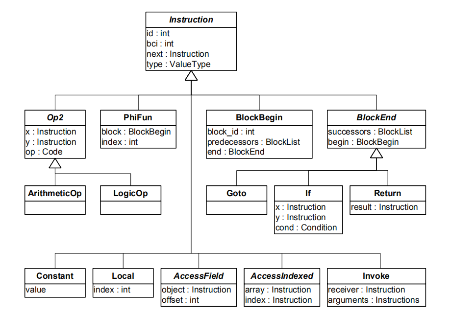
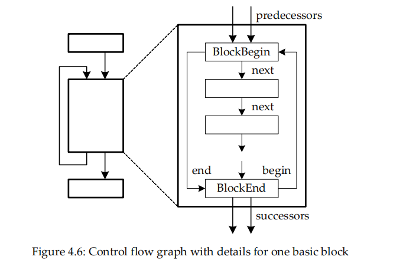

# [Inside HotSpot] C1编译器HIR的构造

## 1. 简介
这篇文章可以说是Christian Wimmer硕士论文[Linear Scan Register Allocation for the Java HotSpot™ Client Compiler](http://compilers.cs.uni-saarland.de/ssasem/talks/Christian.Wimmer.pdf)的不完整翻译，这篇论文详细论述了HotSpot JIT编译器的构造，然后详细解释了C1编译器（研究用，细节和Sun的Client编译器生产级实现有些许出入）中线性扫描寄存器分配算法的设计和实现。
C1编译器内部使用HIR，LIR做为中间表示并进行系列优化和寄存器分配。字节码到HIR的构造是最先完成的步骤，其中HIR是一个平台无关的图结构IR，它的构造位于[`hotspot\share\c1\c1_IR.cpp`](http://hg.openjdk.java.net/jdk/jdk12/file/06222165c35f/src/hotspot/share/c1/c1_IR.cpp)，整个源码的层次如下：



上面是不完整的类层次图，列举了最重要的类。所有的指令都是继承自[Instruction](http://hg.openjdk.java.net/jdk/jdk12/file/06222165c35f/src/hotspot/share/c1/c1_Instruction.cpp)：

```cpp
class Instruction: public CompilationResourceObj {
 private:
    int          _id;                              // 指令id
    int          _use_count;                       // 值的使用计数
    int          _pin_state;                       // pin的原因
    ValueType*   _type;                            // 指令类型
    Instruction* _next;                            // 下一个指令（如果下一个是BlockEnd则为null）
    Instruction* _subst;                           // 替换指令，如果有的话。。
    LIR_Opr      _operand;                         // LIR operand信息
    unsigned int _flags;                           // flag信息

    ValueStack*  _state_before;                    // Copy of state with input operands still on stack (or NULL)
    ValueStack*  _exception_state;                 // Copy of state for exception handling
    XHandlers*   _exception_handlers;              // Flat list of exception handlers covering this instruction

    protected:
    BlockBegin*  _block;                           // 包含该指令的Block的指针
  ..
};
```

## 2. HIR的设计
BlockBegin表示一个基本块的开始，BlockEnd表示结束，两者有一个指针相连，这样可以快速的遍历控制流图，而不需要经过基本块中间的指令。BlockBegin的字段predecessors表示前驱基本块，由于前驱可能是多个，所以是BlockList结构，BlockList是`GrowableArray<BlockBegin*>`，即多个BlockBegin组成的可扩容数组。同理，BlockEnd的successors表示多个后继基本块。



基本块除了BlockBegin，BlockEnd之外就是主体部分，这一部分由具体Instruction组成，每个Instruction有一个next指针（见上面源码），以此可以构成Instruction链表。


 