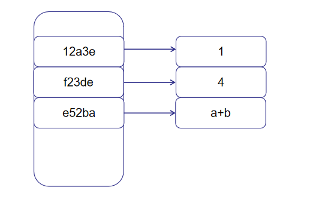

# [Inside HotSpot] C1编译器优化：全局值编号(GVN)

## 1. 值编号
我们知道C1内部使用的是一种图结构的HIR，它由基本块构成一个图，然后每个基本块里面是SSA形式的指令，关于这点如可以参考[[Inside HotSpot] C1编译器工作流程及中间表示](https://www.cnblogs.com/kelthuzadx/p/10740453.html)。值编号(Value numbering)是指**为每个计算得到的值分配一个独一无二的编号**，然后遍历指令寻找可优化的机会。比如下面的代码：
```cpp
a = 1;b=4;
c = a+b;
d = a+b;
e = b;
```
编译器可以在计算a的时候为它指定一个hash值(0x12a3e)然后放入hash表；b同理指定0xf23de放入；遇到a+b时需要为`a+b`这整个指令计算一个hash值，比如可以定义`+`为1，然后`hash(a+b) = hash(a)+1+hash(b)`，算法取决于实现。现在`a+b`的hash值为0xe52ba；当遇到第三行代码`d=a+b`时，编译器查表发现`a+b`已经计算过了，可以直接使用计算过的值，而不需要再次计算`a+b`；最后e也是查表发现b的存在而复用。



值编号的好处最明显的就是公共子表达式的消除，比如上面例子的`a+b`，其它还有常量替换，如果hash(a)发现hash表里面是常量，那么后面对a的使用可以直接替换为1。以及代数恒等式的消除。

前面说了值编号，那么C1使用的全局值编号(Global value numbering,GVN)是在多个基本块里面进行值编号，这样可以扩大优化范围，比如基本块A里面有`a+b`，隔着很远的基本块F里面也有`a+b`，GVN就可以消除该公共子表达式，要注意的坑是全局值编号的"全局"表示一个方法内的多个基本块，而不是编程语言里通常说的跨越方法的全局。与之相对的还有局部值编号(Local value numbering,LVN)，它是指在一个基本块里面发现优化时机，这一步发生在C1编译器构建原始HIR的过程中。

## 2. C1编译器的全局值编号
HotSpot的全局值编号优化位于[hotspot\share\c1\c1_ValueMap.cpp](http://hg.openjdk.java.net/jdk/jdk12/file/06222165c35f/src/hotspot/share/c1/c1_ValueMap.cpp#l487)，它除了完成本职工作外还顺带做了短循环优化和循环不变代码外提。使用虚拟机标志`-XX:+UseGlobalValueNumbering`可开启GVN（默认开启），另外如果虚拟机是`fastdebug`版本，还可以加上`-XX:+PrintValueNumbering -XX:+PrintLIRWithAssembly -XX:+PrintIR`查看C1编译器内部GVN的详细流程。

## 3. 示例：公共子表达式消除（成功)
```java
package com.github.kelthuzadx;

public class C1Optimizations {
    public static int gvn(int invariant, int num){
        int adder = invariant+8;
        while (num<100){
            num=invariant+8;
        }
        return num+adder;
    }

    public static void main(String[] args) {
         gvn(10,1024);
    }
}
```
gvn()函数里面`invariant+8`出现了两次，这样的公共表达式正是GVN大展身手的好地方，先关闭GVN(`-XX:-UseGlovalValueNumbering`)看看机器代码:
```asm
  mov    %eax,-0x9000(%rsp)
  push   %rbp
  sub    $0x30,%rsp                   
                                                          
  mov    %rdx,%rax          ; adder=invariant
  add    $0x8,%eax          ; adder+=8
  jmpq   _Loop           
  nop
_Loop
  mov    %rdx,%rsi          ; tmp = invariant
  add    $0x8,%esi          ; tmp+=8
  add    %r8d,%esi          ; tmp+=num
  mov    0x120(%r15),%r10   ; 安全点
  test   %eax,(%r10)        ; 轮询          
  mov    %rsi,%r8           ; num = tmp    
  cmp    $0x64,%r8d         ; if num<100 
  jl     _Loop                                                                 

  add    %eax,%r8d
  mov    %r8,%rax
  add    $0x30,%rsp
  pop    %rbp
  mov    0x120(%r15),%r10
  test   %eax,(%r10)                  
  retq       
```
公共子表达式没有消除，循环里面创建了临时变量tmp并重复计算`invariant+8`。然后开启GVN（` -XX:-UseGlobalValueNumbering`）:
```asm
  mov    %eax,-0x9000(%rsp)
  push   %rbp
  sub    $0x30,%rsp                   
                                                        
  mov    %rdx,%rax        ; adder=invariant
  add    $0x8,%eax        ; adder+=8
  jmpq   _Loop                                                          
  nop

_Loop:
  add    %eax,%r8d        ; num+=adder
  mov    0x120(%r15),%r10 ; 安全点
  test   %eax,(%r10)      ; 轮询                                                 
  cmp    $0x64,%r8d       ; if num<100
  jl     _Loop           
                                                          
  add    %eax,%r8d        ; num+=adder
  mov    %r8,%rax         ; ret_value = num
  add    $0x30,%rsp
  pop    %rbp
  mov    0x120(%r15),%r10
  test   %eax,(%r10)                  
  retq   
```
循环中检测到`invariant+8`是公共子表达式，已经计算过值，所以直接复用`num+=adder`。

## 4. 示例：代数恒等式变换（失败）
还是之前的例子，我们增加一些数学恒等式：
```java
public static int gvn(int invariant, int num){
    int adder = invariant+8;
    while (num<100){
        num+=invariant+8;
        num*=1;
        num/=1;
        num+=0;
        num-=0;
    }
    return num+adder;
}
```
HotSpot的GVN没有进行代数恒等式的变换，无论是否开启GVN都会产出对应的代码：
```asm
_Loop
  add    %edi,%r8d         
  shl    $0x0,%r8d         
  mov    %r8,%rax       
  mov    $0x1,%ebx
  cmp    $0x80000000,%eax
  jne    0x000002ee006b9226
  xor    %edx,%edx
  cmp    $0xffffffff,%ebx
  je     0x000002ee006b9229
  cltd   
  idiv   %ebx                                                                                 
  mov    0x120(%r15),%r10               
  test   %eax,(%r10)                    
  mov    %rax,%r8                       
  cmp    $0x64,%r8d
  jl     _Loop             
```
相比之下`g++ 8.0`和`clang++ 8.0`在`-O1`优化强度上消除了多余的恒等式：
```cpp
// g++ 8.0
gvn(int, int):
        lea     eax, [rdi+8]
        cmp     esi, 99
        jg      .L2
.L3:
        add     esi, eax
        cmp     esi, 99
        jle     .L3
.L2:
        add     eax, esi
        ret
// clang++ 8.0
gvn(int, int):                               # @gvn(int, int)
        mov     eax, esi
        mov     ecx, -8
        sub     ecx, edi
        add     edi, 8
.LBB0_1:                                # =>This Inner Loop Header: Depth=1
        add     eax, edi
        lea     edx, [rcx + rax]
        cmp     edx, 100
        jl      .LBB0_1
        ret
```
所以写Java的时候遇到恒等式(很少情况)如果可以请手动消除。

## 5. 循环不变代码外提（成功但受限）
循环不变代码外提(Loop Invariant Code Motion)很好理解，如果循环内某个值不会发生改变，那么不必每次都做计算，可以提到循环外面。但是循环不变代码外提优化有个严重的问题，它仅在关闭分层编译模式(`-XX:-TieredCompilation`)下才能进行。。。
```java
public static int loopInvariantCodeMotion(int invariant, int num){
    for(int i=0;i<invariant*8+10;i++){
        num+=i;
    }
    return num;
}
```
关闭分层编译得到产出如下：
```asm
  mov    %eax,-0x9000(%rsp)
  push   %rbp
  sub    $0x30,%rsp                     
                                                            
  mov    %rdx,%rax    ; tmp = invariant
  shl    $0x3,%eax    ; tmp*=8;
  add    $0xa,%eax    ; tmp+= 10
  mov    $0x0,%esi    ; i=0
  jmpq   _Cond                                                              
  nop

_Loop
  add    %esi,%r8d    ; num+=i
  inc    %esi         ; i++
  mov    0x120(%r15),%r10  ;安全点                                                                
  test   %eax,(%r10)       ;轮询       
_Cond:
  cmp    %eax,%esi    ; if i<tmp
  jl     _Loop             

  mov    %r8,%rax
  add    $0x30,%rsp
  pop    %rbp
  mov    0x120(%r15),%r10
  test   %eax,(%r10)                    
  retq   
```
如果可能，请尽量将循环不变代码手动外提，而不是（盲目）依赖JIT编译器。

最后想多说一点，我们不能简单的根据某个指标来评判事物好坏，看到C++做了某种优化Java没做就批评Java，这样不好也是不公平的，与其口舌之争不如深入分析为什么后者没有做某种优化。虚拟机的编译是JIT，动态编译器的编译成本是需要计算在运行成本之内的，它的每个优化都需要经过深思熟虑。