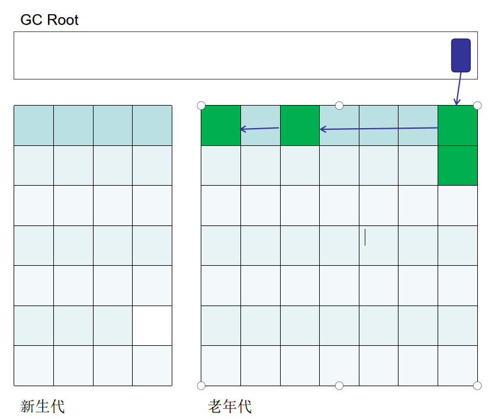

# [Inside HotSpot] Java分代堆

## 1. 宇宙初始化
JVM在启动的时候会初始化各种结构，比如模板解释器，类加载器，当然也包括这篇文章的主题，Java堆。在hotspot源码结构中`gc/shared`表示所有GC共同拥有的信息，`gc/g1`,`gc/cms`则是不同实现需要用到的特设信息。
```bash
λ tree
├─gc
│  ├─cms
│  ├─epsilon
│  ├─g1
│  ├─parallel
│  ├─serial
│  ├─shared
│  └─z
```
比如所有的Java堆都继承自CollectedHeap,这个结构就位于`gc/shared`，然后Serial GC需要的特设信息位于`gc/serial`，关于这点我们后面马上会提到。另外Java堆的类型很多，本文所述Java堆均为分代堆(Generational Heap)，它广泛用于Serial GC,CMS GC：


关于什么是分代堆应该不用多说，新生代老年代堆模型都是融入每个Javer灵魂的东西。

在讨论分代堆之前，我们先从头说起。Java堆初始化会经过一个调用链：
```js
JNI_CreateJavaVM(prims/jni.cpp)
  ->JNI_CreateJavaVM_inner
    ->Threads::create_vm(runtime/thread.cpp)
      ->init_globals(runtime/init.cpp)
        ->universe_init(memory/universe.cpp)
          ->Universe::initialize_heap()
```
Universe模块（宇宙模块？hh）会负责高层次的Java堆的创建与初始化：
```cpp
jint Universe::initialize_heap() {
  // 创建Java堆
  _collectedHeap = create_heap();
  // 初始化Java堆
  jint status = _collectedHeap->initialize();
  if (status != JNI_OK) {
    return status;
  }
  // 使用的GC，如[38.500s][info][gc] Using G1
  log_info(gc)("Using %s", _collectedHeap->name());

  ThreadLocalAllocBuffer::set_max_size(Universe::heap()->max_tlab_size());

  if (UseCompressedOops) {
    if ((uint64_t)Universe::heap()->reserved_region().end() > UnscaledOopHeapMax) {
      Universe::set_narrow_oop_shift(LogMinObjAlignmentInBytes);
    }
    if ((uint64_t)Universe::heap()->reserved_region().end() <= OopEncodingHeapMax) {
      Universe::set_narrow_oop_base(0);
    }
    AOTLoader::set_narrow_oop_shift();

    Universe::set_narrow_ptrs_base(Universe::narrow_oop_base());

    LogTarget(Info, gc, heap, coops) lt;
    if (lt.is_enabled()) {
      ResourceMark rm;
      LogStream ls(lt);
      Universe::print_compressed_oops_mode(&ls);
    }
    Arguments::PropertyList_add(new SystemProperty("java.vm.compressedOopsMode",
                                                   narrow_oop_mode_to_string(narrow_oop_mode()),
                                                   false));
  }

  // TLAB初始化
  if (UseTLAB) {
    assert(Universe::heap()->supports_tlab_allocation(),
           "Should support thread-local allocation buffers");
    ThreadLocalAllocBuffer::startup_initialization();
  }
  return JNI_OK;
}
```

## 2. 创建Java堆
在JVM初始化宇宙模块时会调用create_heap()创建堆，这个函数会进一步调用位于`memory/allocation`模块的AllocateHeap，但是这些APIs实际还没有做分配动作，它们只是包装底层分配，处理一下分配失败，真正的内存分配是位于底层`runtime/os`模块：


说到`runtime/os`是底层内存分配，那它到底有多底层？打开源码看看，并没有像OS这个名字一样使用操作系统的VirtualAlloc，sbrk，而是使用C/C++语言运行时的`malloc()/free()`进行分配/释放的。

## 3. 初始化Java堆
在第一步中create_heap()创建了堆这个数据结构，但是里面的成员都是无效的，而第二步就是负责初始化这些成员。初始化分为initialize()和post_initialize()。
```cpp
// hotspot\share\gc\shared\genCollectedHeap.cpp
jint GenCollectedHeap::initialize() {
  char* heap_address;
  ReservedSpace heap_rs;
  // 获取堆对齐
  size_t heap_alignment = collector_policy()->heap_alignment();
  // 给堆分配空间
  heap_address = allocate(heap_alignment, &heap_rs);
  // 如果分配失败则关闭虚拟机
  if (!heap_rs.is_reserved()) {
    vm_shutdown_during_initialization(
      "Could not reserve enough space for object heap");
    return JNI_ENOMEM;
  }
  // 根据刚刚获得的堆空间来初始化
  // CollectedHeap中的_reserved字段
  initialize_reserved_region((HeapWord*)heap_rs.base(), (HeapWord*)(heap_rs.base() + heap_rs.size()));
  
  // 创建并初始化remembered set
  _rem_set = create_rem_set(reserved_region());
  _rem_set->initialize();
  CardTableBarrierSet *bs = new CardTableBarrierSet(_rem_set);
  bs->initialize();
  BarrierSet::set_barrier_set(bs);
  
  // 根据刚刚获得的堆来初始化GenCollectedHeap的新生代
  ReservedSpace young_rs = heap_rs.first_part(_young_gen_spec->max_size(), false, false);
  _young_gen = _young_gen_spec->init(young_rs, rem_set());
  heap_rs = heap_rs.last_part(_young_gen_spec->max_size());
 // 根据刚刚获得的堆来初始化GenCollectedHeap的老年代
  ReservedSpace old_rs = heap_rs.first_part(_old_gen_spec->max_size(), false, false);
  _old_gen = _old_gen_spec->init(old_rs, rem_set());
  clear_incremental_collection_failed();

  return JNI_OK;
}
```
initialize()初始化新生代老年代，完成基础的分代；然后post_initialize()将新生代细分为Eden和Survivor，然后再初始化标记清楚算法用到的一些数据结构。至此JVM的分代堆就可以为垃圾回收器所用了。

## 4. JVM分代堆详细结构
### 4.1 CollectedHeap
前面我们提到JVM是如何建立一个堆的，这一节将详细分析这个堆长什么样子。JVM有很多垃圾回收器，每个垃圾回收器处理的堆结构都是不一样的，比如G1GC处理的堆是由Region组成，CMS处理由老年代新生代组成的分代堆。这些不同的堆类型都继承自`gc/share/CollectedHeap`，抽象基类CollectedHeap表示所有堆都拥有的一些属性：


```cpp
// hotspot\share\gc\shared\collectedHeap.hpp
class CollectedHeap : public CHeapObj<mtInternal> {
 private:
  GCHeapLog* _gc_heap_log;                  // GC日志
  MemRegion _reserved;                      // 堆内存表示
 protected:
  bool _is_gc_active;                       // 是否正在GC

  unsigned int _total_collections;          // Minor GC次数
  unsigned int _total_full_collections;     // Full GC次数

  GCCause::Cause _gc_cause;                 // 当前引发GC的原因
  GCCause::Cause _gc_lastcause;             // 上次引发GC的原因
  ...
};
```
上面的**_reserved**就表示Java堆这片连续的地址，它包含堆的起始地址和大小，即`[start,start+size]`。然而这样的堆是不能满足GC需求的，Full GC处理老年代，Minor GC处理新生代，可是这两个“代”都没有在CollectedHeap中体现。翻翻上图继承模型，GenCollectedHeap才是分代堆。

### 4.2 GenCollectedHeap
```cpp
//hotspot\share\gc\shared\genCollectedHeap.hpp
class GenCollectedHeap : public CollectedHeap {
public:
  enum GenerationType {
    YoungGen,
    OldGen
  };

protected:
  Generation* _young_gen;     // 新生代
  Generation* _old_gen;       // 老年代
  ...
};
```
看到GenCollectedHeap里面的`_young_gen`和`_old_gen`基本就稳了。它继承自CollectedHeap，其中CollectedHeap里面的_reserved表示整个堆，GenCollectedHeap的新生代和老年代进一步划分_reserved。这个划分工作发生在堆初始化中。不同GC使用的新生代老年代也是不同的，所以不能一概而论，hotspot为此建立了如下分代模型：


+ 分代基类：公有结构，保存上次GC耗时，该代的内存起始地址，GC性能计数
+ 默认新生代：一种包含Eden,From survivor, To survivor的分代
+ 并行新生代：可并行GC的默认新生代
+ 卡表代：包含卡表(CardTable)的分代
+ 久任代：可Mark-Compact的卡表代
+ 并行标记清楚代：可并行Mark-Sweep的卡表代

每个代都自己的特色，不同GC根据不同需要可以"自由"组合，比如Serial GC就使用的是`DefNewGeneration` + `TenuredGeneration`的组合，CMS使用`ParNewGeneration` + `ConcurrentMarkSweepGeneration`的组合。

### 4.3 SerialHeap
最后一步，Serial GC专用的堆继承自GenCollectedHeap并在其上稍作封装。这个SerialHeap最终将用于串行垃圾回收器(`-XX:+UseSerialGC`)。
```cpp
// hotspot\share\gc\serial\serialHeap.hpp
class SerialHeap : public GenCollectedHeap {
  static SerialHeap* heap();
  virtual Name kind() const {
    return CollectedHeap::Serial;
  }
  virtual const char* name() const {
    return "Serial";
  }
  ...
};
```

## 5. 分代堆中的卡表代
关于GenCollectedHeap的各种代还有很多内容，我们关注`DefNewGeneration` + `TenuredGeneration`的组合，它被用于SerialGC。

久任代继承自卡表代，所谓卡表代是指用卡(Card)划分整个老年代。我们知道，标记清除需要遍历整个老年代来找出指向新生代的指针，至于为什么要做这个遍历看两副图即可明白。假设有堆中已经存在这样的引用关系：



现在加入分配了新的对象：


其中老年代的对象存在指向新生代的指针，但是GC Root并没有，如果这时候只从GC Root出发标记对象，就会错过红线指向的对象，继而导致被误做垃圾而清除，所以必须遍历老年代找到指向新生代的对象。但是问题是老年代一般都很大，这样的遍历是比较慢的。卡表应此而生，它将老年代划分为512byte的卡(Card)，这些卡组成卡表(Card table)。如果卡表为dirty则表示该512byte的区域不存在指向新生代的引用，那么就可以直接跳过该区域，减少了遍历时间：


在上图中只有卡1和卡5存在指向新生代的指针，对整个老年代的遍历就缩小到只对卡1、卡5的遍历了。
