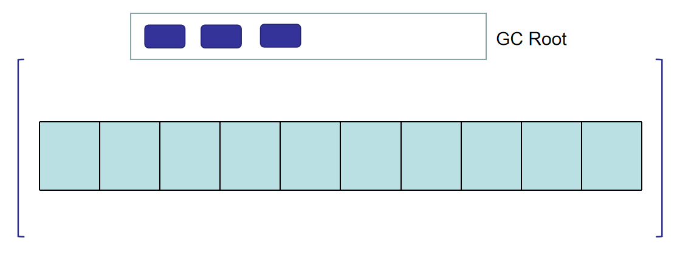
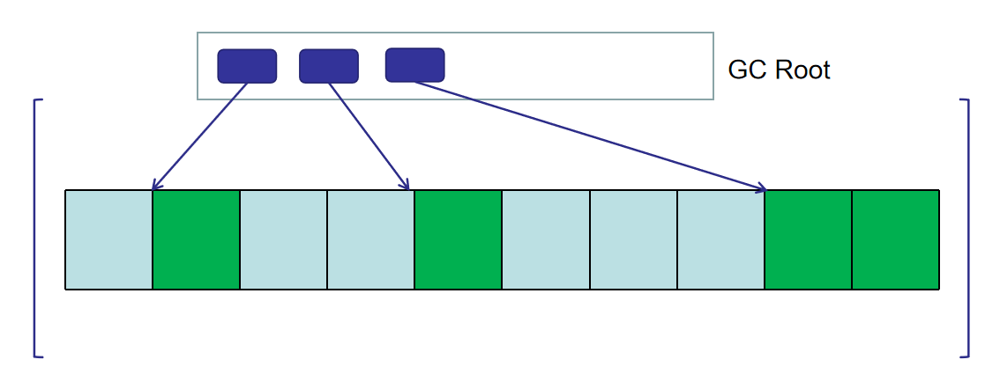
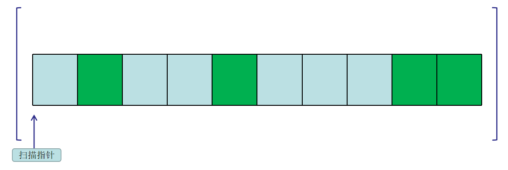
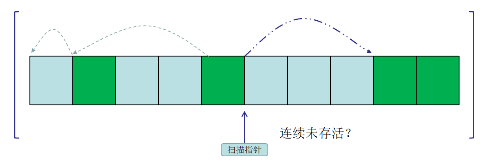
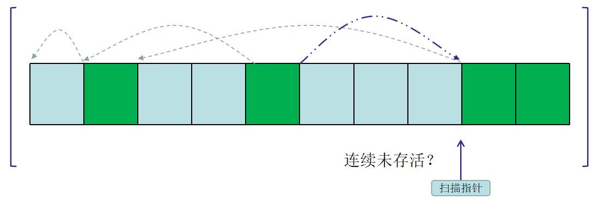
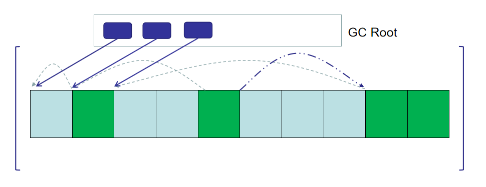
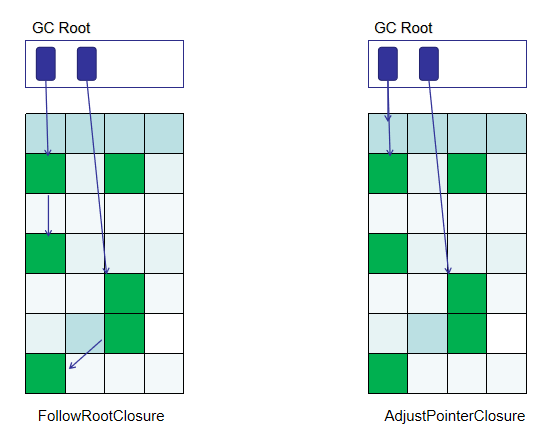
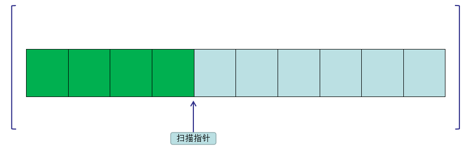

# [Inside HotSpot] Serial垃圾回收器

# Serial垃圾回收器Full GC
Serial垃圾回收器的Full GC使用标记-压缩(Mark-Compact)进行垃圾回收，该算法基于Donald E. Knuth提出的Lisp2算法，它会把所有存活对象滑动到空间的一端，所以也叫sliding compact。Full GC始于`gc/serial/tenuredGeneration`的TenuredGeneration::collect，它会在GC前后记录一些日志，真正的标记压缩算法发生在GenMarkSweep::invoke_at_safepoint，我们可以使用`-Xlog:gc*`得到该算法的流程：
```bash
 GC(0) Pause Young (Allocation Failure)
 GC(1) Pause Full (Allocation Failure)
 GC(1) Phase 1: Mark live objects
 GC(1) Phase 1: Mark live objects 1.136ms
 GC(1) Phase 2: Compute new object addresses
 GC(1) Phase 2: Compute new object addresses 0.170ms
 GC(1) Phase 3: Adjust pointers
 GC(1) Phase 3: Adjust pointers 0.435ms
 GC(1) Phase 4: Move objects
 GC(1) Phase 4: Move objects 0.208ms
```
标记-压缩分为四个阶段（如果是fastdebug版jvm，可以使用`-Xlog:gc*=trace`得到更为详细的日志，不过可能详细过头了...），这篇文章将围绕四个阶段展开。

## 1. 阶段1：标记存活对象
第一阶段对应GC日志的`GC(1) Phase 1: Mark live objects`
JVM在`process_string_table_roots()`和`process_roots()`中会遍历所有类型的GC Root，然后使用`XX::oops_do(root_closure)`从该GC Root出发标记所有存活对象。XX表示GC Root类型，root_closure表示**标记存活对象**的方法(闭包)。GC模块有很多闭包(closure)，它们代表的是一段代码、一种行为。root_closure就是一个`MarkSweep::FollowRootClosure`闭包。这个闭包很强大，给它一个对象，就能标记这个对象，迭代标记对象的成员，以及对象所在的栈的所有对象及其成员：
```cpp
// hotspot\share\gc\serial\markSweep.cpp
void MarkSweep::FollowRootClosure::do_oop(oop* p)       { follow_root(p); }

template <class T> inline void MarkSweep::follow_root(T* p) {
  // 如果引用指向的对象不为空且未标记
  T heap_oop = RawAccess<>::oop_load(p);
  if (!CompressedOops::is_null(heap_oop)) {
    oop obj = CompressedOops::decode_not_null(heap_oop);
    if (!obj->mark_raw()->is_marked()) {
      mark_object(obj);   // 标记对象
      follow_object(obj); // 标记对象的成员 
    }
  }
  follow_stack();       // 标记引用所在栈
}
// 如果对象是数组对象则标记数组，否则标记对象的成员
inline void MarkSweep::follow_object(oop obj) {
  if (obj->is_objArray()) {
    MarkSweep::follow_array((objArrayOop)obj);
  } else {
    obj->oop_iterate(&mark_and_push_closure);
  }
}

// 标记引用所在的整个栈
void MarkSweep::follow_stack() {
  do {
    // 如果待标记栈不为空则逐个标记
    while (!_marking_stack.is_empty()) {
      oop obj = _marking_stack.pop();
      follow_object(obj);
    }
    // 如果对象数组栈不为空则逐个标记
    if (!_objarray_stack.is_empty()) {
      ObjArrayTask task = _objarray_stack.pop();
      follow_array_chunk(objArrayOop(task.obj()), task.index());
    }
  } while (!_marking_stack.is_empty() || !_objarray_stack.is_empty());
}

// 标记数组的类型的Class和数组成员，比如String[] p = new String[2]
// 对p标记会同时标记java.lang.Class，p[1],p[2]
inline void MarkSweep::follow_array(objArrayOop array) {
  MarkSweep::follow_klass(array->klass());
  if (array->length() > 0) {
    MarkSweep::push_objarray(array, 0);
  }
}
```





既然走到这里了不如看看JVM是如何标记对象的：
```cpp
inline void MarkSweep::mark_object(oop obj) {
  // 获取对象的mark word
  markOop mark = obj->mark_raw();
  // 设置gc标记
  obj->set_mark_raw(markOopDesc::prototype()->set_marked());
  // 垃圾回收器视情况保留对象的gc标志
  if (mark->must_be_preserved(obj)) {
    preserve_mark(obj, mark);
  }
}
```
对象的mark work有32bits或者64bits，取决于CPU架构和UseCompressedOops：
```js
// hotspot\share\oops\markOop.hpp
32 位mark lword：
          hash:25 ------------>| age:4    biased_lock:1 lock:2 (normal object)
          JavaThread*:23 epoch:2 age:4    biased_lock:1 lock:2 (biased object)
          size:32 ------------------------------------------>| (CMS free block)
          PromotedObject*:29 ---------->| promo_bits:3 ----->| (CMS promoted object)

最后的lock2位有不同含义：
          [ptr             | 00]  locked             ptr指向栈上真正的对象头
          [header      | 0 | 01]  unlocked           普通对象头
          [ptr             | 10]  monitor            膨胀锁
          [ptr             | 11]  marked             GC标记
```
原来垃圾回收标记就是对每个对象mark word最后两位置11，可是如果最后两位用于其他用途怎么办？比如这个对象的最后两位表示膨胀锁，那GC就不能对它进行标记了，所以垃圾回收器还需要视情况在额外区域保留对象的mark word（PreservedMark）。回到之前的话题，GC Root有很多，有的是我们耳熟能详的，有的则是略微少见：

+ 所有已加载的类(`ClassLoaderDataGraph::roots_cld_do`)
+ 所有Java线程当前栈帧的引用和虚拟机内部线程(`Threads::possibly_parallel_oops_do`)
+ JVM内部使用的引用(`Universe::oopds_do`和`SystemDictionary::oops_do`)
+ JNI handles(`JNIHandles::oops_do`)
+ 所有synchronized锁住的对象引用(`ObjectSynchronizer::oops_do`)
+ java.lang.management对象(`Management::oops_do`)
+ JVMTI导出(`JvmtiExport::oops_do`)
+ AOT代码的堆(`AOTLoader::oops_do`)
+ code cache(`CodeCache::blobs_do`)
+ String常量池(`StringTable::oops_do`)

它们都包含可进行标记的引用，会视情况进行单线程标记或者并发标记，JVM会使用CAS(Atomic::cmpxchg)自旋锁等待标记任务。如果任务全部完成，即标记线程和完成计数相等，就结束阻塞。当对象标记完成后jvm还会使用`ref_processor()->process_discovered_references()`对弱引用，软引用，虚引用，final引用（重写了finialize()方法的引用）根据它们的Java语义做特殊处理，不过与算法本身没有太大关系，有兴趣的请自行了解。


## 2. 阶段2：计算对象新地址

计算对象新地址的思想是：从地址空间开始扫描，如果cur_obj指针指向已经GC标记过的对象，则将该对象的新地址设置为compact_top，然后compact_top推进，cur_obj推进，直至cur_obj到达地址空间结束。


计算新地址伪代码如下:
```cpp
// 扫描堆空间
while(cur_obj<space_end){
  if(cur_obj->is_gc_marked()){
    // 如果cur_Obj当前指向已标记过的对象，就计算新的地址
    int object_size += cur_obj->size();
    cur_obj->new_address = compact_top;
    compact_top = cur_obj;
    cur_obj += object_size;
  }else{
    // 否则快速跳过未标记的连续空间
    while(cur_obj<space_end &&!cur_obj->is_gc_marked()){
      cur_obj += cur_obj->size();
    }
  }
}
```
有了上面的认识，对应到HotSpot实现也比较简单了。计算对象新地址的代码位于CompactibleSpace::scan_and_forward:
```cpp
// hotspot\share\gc\shared\space.inline.hpp
template <class SpaceType>
inline void CompactibleSpace::scan_and_forward(SpaceType* space, CompactPoint* cp) {
  ...
  // compact_top为对象新地址的起始
  HeapWord* compact_top = cp->space->compaction_top(); 
  DeadSpacer dead_spacer(space);
  //最后一个标记对象
  HeapWord*  end_of_live = space->bottom(); 
  // 第一个未标记对象
  HeapWord*  first_dead = NULL;

  const intx interval = PrefetchScanIntervalInBytes;

  // 扫描指针
  HeapWord* cur_obj = space->bottom();
  // 扫描终点
  HeapWord* scan_limit = space->scan_limit();
  // 扫描老年代
  while (cur_obj < scan_limit) {
    // 如果cur_obj指向已标记对象
    if (space->scanned_block_is_obj(cur_obj) && oop(cur_obj)->is_gc_marked()) {
      Prefetch::write(cur_obj, interval);
      size_t size = space->scanned_block_size(cur_obj);
      // 给cur_obj指向的对象设置新地址，并前移compact_top
      compact_top = cp->space->forward(oop(cur_obj), size, cp, compact_top);
      // cur_obj指针前移
      cur_obj += size;
      // 修改最后存活对象指针地址
      end_of_live = cur_obj;
    } else {
      // 如果cur_obj指向未标记对象，则获取这片（可能连续包含未标记对象的）空间的大小
      HeapWord* end = cur_obj;
      do {
        Prefetch::write(end, interval);
        end += space->scanned_block_size(end);
      } while (end < scan_limit && (!space->scanned_block_is_obj(end) || !oop(end)->is_gc_marked()));

      // 如果需要减少对象移动频率
      if (cur_obj == compact_top && dead_spacer.insert_deadspace(cur_obj, end)) {
        oop obj = oop(cur_obj);
        compact_top = cp->space->forward(obj, obj->size(), cp, compact_top);
        end_of_live = end;
      } else {
        // 否则跳过未存活对象
        *(HeapWord**)cur_obj = end;
        // 如果first_dead为空则将这片空间设置为第一个未存活对象
        if (first_dead == NULL) {
          first_dead = cur_obj;
        }
      }
      // cur_obj指针快速前移
      cur_obj = end;
    }
  }
  ...
}
```







如果对象需要移动，`cp->space->forward()`会将新地址放入对象的mark word里面。计算对象新地址里面有个小技巧可以参见上图图2，当扫描到连续多个未存活对象的时候，它把第一个未存活对象设置为该片区域结尾的指针，这样下一次扫描到第一个对象可以直接跳到区域尾，节约时间。

## 3. 阶段3：调整对象指针
第二阶段设置了所有对象的新地址，但是没有改变对象的相对地址和GC Root。比如GC Root指向对象A，B，C，这时候A、B、C都有新地址A',B',C'，GC Root应该相应调整为指向A',B',C':



第三阶段就是干这件事的。还记得第一阶段GC Root的标记行为吗？

> JVM在`process_string_table_roots()`和`process_roots()`中会遍历所有类型的GC Root，然后使用`XX::oops_do(root_closure)`从该GC Root出发标记所有存活对象。XX表示GC Root类型，root_closure表示**标记存活对象**的方法（闭包）。

第三阶段和第一阶段一样，只是第一阶段传递的root_closure表示**标记存活对象**的闭包(`FollowRootClosure`)，第三阶段传递的root_closure表示**调整对象指针**的闭包`AdjustPointerClosure`：
```cpp
// hotspot\share\gc\serial\markSweep.inline.hpp
inline void AdjustPointerClosure::do_oop(oop* p)       { do_oop_work(p); }
template <typename T>
void AdjustPointerClosure::do_oop_work(T* p)           { MarkSweep::adjust_pointer(p); }

template <class T> inline void MarkSweep::adjust_pointer(T* p) {
  T heap_oop = RawAccess<>::oop_load(p);
  if (!CompressedOops::is_null(heap_oop)) {
    // 从地址p处得到对象
    oop obj = CompressedOops::decode_not_null(heap_oop);
    // 从对象mark word中得到新对象地址
    oop new_obj = oop(obj->mark_raw()->decode_pointer());
    if (new_obj != NULL) {
      // 将地址p处设置为新对象地址
      RawAccess<IS_NOT_NULL>::oop_store(p, new_obj);
    }
  }
}
```
`AdjustPointerClosure`闭包会遍历所有GC Root然后调整对象指针，注意，这里和第一阶段有个重要不同是第一阶段传递的`FollowRootClosure`闭包会从GC Root出发标记所有可达对象，但是`AdjustPointerClosure`闭包只会标记GC Root出发直接可达的对象，



从对象出发寻找可达其他对象这一步是使用的另一个闭包`GenAdjustPointersClosure`，它会调用CompactibleSpace::scan_and_adjust_pointers遍历整个堆空间然后调整存活对象的指针：
```cpp
//hotspot\share\gc\shared\space.inline.hpp
template <class SpaceType>
inline void CompactibleSpace::scan_and_adjust_pointers(SpaceType* space) {
  // 扫描指针
  HeapWord* cur_obj = space->bottom();
  // 最后一个标记对象
  HeapWord* const end_of_live = space->_end_of_live;
  // 第一个未标记对象
  HeapWord* const first_dead = space->_first_dead; 
  const intx interval = PrefetchScanIntervalInBytes;

  // 扫描老年代
  while (cur_obj < end_of_live) {
    Prefetch::write(cur_obj, interval);
    // 如果扫描指针指向的对象是存活对象
    if (cur_obj < first_dead || oop(cur_obj)->is_gc_marked()) {
      // 调整该对象指针，调整方法和AdjustPointerClosure所用一样
      size_t size = MarkSweep::adjust_pointers(oop(cur_obj));
      size = space->adjust_obj_size(size);
      // 指针前移
      cur_obj += size;
    } else {
      // 否则扫描指针指向未存活对象，设置扫描指针为下一个存活对象，加速前移
      cur_obj = *(HeapWord**)cur_obj;
    }
  }
}
```

## 4. 阶段4：移动对象
第四阶段传递`GenCompactClosure`闭包，该闭包负责对象的移动：



移动的代码位于CompactibleSpace::scan_and_compact：
```cpp
//hotspot\share\gc\shared\space.inline.hpp
template <class SpaceType>
inline void CompactibleSpace::scan_and_compact(SpaceType* space) {
  verify_up_to_first_dead(space);
  // 老年代起始位置
  HeapWord* const bottom = space->bottom();
  // 最后一个标记对象
  HeapWord* const end_of_live = space->_end_of_live;

  // 如果该区域所有对象都存活，或者没有任何对象，或者没有任何存活对象
  // 就不需要进行移动
  if (space->_first_dead == end_of_live && (bottom == end_of_live || !oop(bottom)->is_gc_marked())) {
    clear_empty_region(space);
    return;
  }

  const intx scan_interval = PrefetchScanIntervalInBytes;
  const intx copy_interval = PrefetchCopyIntervalInBytes;

  // 设置扫描指针cur_obj为空间底部
  HeapWord* cur_obj = bottom;
  // 跳到第一个存活的对象
  if (space->_first_dead > cur_obj && !oop(cur_obj)->is_gc_marked()) {
    cur_obj = *(HeapWord**)(space->_first_dead);
  }

  // 从空间开始到最后一个存活对象为截止进行扫描
  while (cur_obj < end_of_live) {
    // 如果cur_obj执行的对象未标记
    if (!oop(cur_obj)->is_gc_marked()) {
      // 扫描指针快速移动至下一个存活的对象（死对象的第一个word
      // 存放了下一个存活对象的地址，这样就可以快速移动）
      cur_obj = *(HeapWord**)cur_obj;
    } else {
      Prefetch::read(cur_obj, scan_interval);

      size_t size = space->obj_size(cur_obj);
      // 获取对象将要被移动到的新地址
      HeapWord* compaction_top = (HeapWord*)oop(cur_obj)->forwardee();
      Prefetch::write(compaction_top, copy_interval);

      // 移动对象，并初始化对象的mark word
      Copy::aligned_conjoint_words(cur_obj, compaction_top, size);
      oop(compaction_top)->init_mark_raw();

      // 扫描指针前移
      cur_obj += size;
    }
  }

  clear_empty_region(space);
}
```
另外值得注意的是Full GC的四个步骤都是针对整个堆的，也就是说新生代的Eden，From survivor， To survivor，老年代全都做了标记压缩操作，而不只是老年代。


# Serial垃圾回收器Minor GC
## 1. DefNewGeneration垃圾回收
新生代使用复制算法对新生代做垃圾回收，比老年代的标记-压缩简单很多，所有回收代码都位于DefNewGeneration::collect：
```cpp
// hotspot\share\gc\serial\defNewGeneration.cpp
void DefNewGeneration::collect(bool   full,
                               bool   clear_all_soft_refs,
                               size_t size,
                               bool   is_tlab) {
  SerialHeap* heap = SerialHeap::heap();

  _gc_timer->register_gc_start();
  DefNewTracer gc_tracer;
  gc_tracer.report_gc_start(heap->gc_cause(), _gc_timer->gc_start());
  _old_gen = heap->old_gen();

  // 如果新生代全是存活对象，老年代可能容不下新生代的晋升
  // 则设置增量垃圾回收失败，直接返回
  if (!collection_attempt_is_safe()) {
    log_trace(gc)(":: Collection attempt not safe ::");
    heap->set_incremental_collection_failed(); 
    return;
  }

  init_assuming_no_promotion_failure();
  GCTraceTime(Trace, gc, phases) tm("DefNew", NULL, heap->gc_cause());
  heap->trace_heap_before_gc(&gc_tracer);

  // 存活检查闭包
  IsAliveClosure is_alive(this);
  // 扫描弱引用闭包
  ScanWeakRefClosure scan_weak_ref(this);
  
  age_table()->clear();
  to()->clear(SpaceDecorator::Mangle);
  _preserved_marks_set.init(1);
  heap->rem_set()->prepare_for_younger_refs_iterate(false);
  
  // 快速扫描闭包
  FastScanClosure fsc_with_no_gc_barrier(this, false);
  // 带GC屏障的快速扫描闭包（老年代扫描专用）
  FastScanClosure fsc_with_gc_barrier(this, true);

  // 类加载数据扫描闭包
  CLDScanClosure cld_scan_closure(&fsc_with_no_gc_barrier,
                                  heap->rem_set()->cld_rem_set()->accumulate_modified_oops());

  set_promo_failure_scan_stack_closure(&fsc_with_no_gc_barrier);
  FastEvacuateFollowersClosure evacuate_followers(heap,
                                                  &fsc_with_no_gc_barrier,
                                                  &fsc_with_gc_barrier);

  assert(heap->no_allocs_since_save_marks(),
         "save marks have not been newly set.");

  {
    // 扫描新生代GC Root
    StrongRootsScope srs(0);
    heap->young_process_roots(&srs,
                              &fsc_with_no_gc_barrier,
                              &fsc_with_gc_barrier,
                              &cld_scan_closure);
  }

  // "evacuate followers".
  evacuate_followers.do_void();

  FastKeepAliveClosure keep_alive(this, &scan_weak_ref);
  ReferenceProcessor* rp = ref_processor();
  rp->setup_policy(clear_all_soft_refs);
  ReferenceProcessorPhaseTimes pt(_gc_timer, rp->max_num_queues());
  const ReferenceProcessorStats& stats =
  rp->process_discovered_references(&is_alive, &keep_alive, &evacuate_followers,
                                    NULL, &pt);
  gc_tracer.report_gc_reference_stats(stats);
  gc_tracer.report_tenuring_threshold(tenuring_threshold());
  pt.print_all_references();

  WeakProcessor::weak_oops_do(&is_alive, &keep_alive);

  // 如果晋升成功
  if (!_promotion_failed) {
    // 交换from，to survivors分区
    eden()->clear(SpaceDecorator::Mangle);
    from()->clear(SpaceDecorator::Mangle);
    if (ZapUnusedHeapArea) {
      // This is now done here because of the piece-meal mangling which
      // can check for valid mangling at intermediate points in the
      // collection(s).  When a young collection fails to collect
      // sufficient space resizing of the young generation can occur
      // an redistribute the spaces in the young generation.  Mangle
      // here so that unzapped regions don't get distributed to
      // other spaces.
      to()->mangle_unused_area();
    }
    swap_spaces();
    
    // 每次做完新生代GC后to survivor一定是空的 
    assert(to()->is_empty(), "to space should be empty now");
    
    // 调整老年代晋升阈值
    adjust_desired_tenuring_threshold();

    // A successful scavenge should restart the GC time limit count which is
    // for full GC's.
    AdaptiveSizePolicy* size_policy = heap->size_policy();
    size_policy->reset_gc_overhead_limit_count();
    assert(!heap->incremental_collection_failed(), "Should be clear");
  } else {
    // 否则晋升失败
    assert(_promo_failure_scan_stack.is_empty(), "post condition");
    _promo_failure_scan_stack.clear(true); // Clear cached segments.

    remove_forwarding_pointers();
    log_info(gc, promotion)("Promotion failed");
    // Add to-space to the list of space to compact
    // when a promotion failure has occurred.  In that
    // case there can be live objects in to-space
    // as a result of a partial evacuation of eden
    // and from-space.
    swap_spaces();   // For uniformity wrt ParNewGeneration.
    from()->set_next_compaction_space(to());
    heap->set_incremental_collection_failed();

    // Inform the next generation that a promotion failure occurred.
    _old_gen->promotion_failure_occurred();
    gc_tracer.report_promotion_failed(_promotion_failed_info);

    // Reset the PromotionFailureALot counters.
    NOT_PRODUCT(heap->reset_promotion_should_fail();)
  }
  // We should have processed and cleared all the preserved marks.
  _preserved_marks_set.reclaim();
  // set new iteration safe limit for the survivor spaces
  from()->set_concurrent_iteration_safe_limit(from()->top());
  to()->set_concurrent_iteration_safe_limit(to()->top());

  // We need to use a monotonically non-decreasing time in ms
  // or we will see time-warp warnings and os::javaTimeMillis()
  // does not guarantee monotonicity.
  jlong now = os::javaTimeNanos() / NANOSECS_PER_MILLISEC;
  update_time_of_last_gc(now);

  heap->trace_heap_after_gc(&gc_tracer);

  _gc_timer->register_gc_end();

  gc_tracer.report_gc_end(_gc_timer->gc_end(), _gc_timer->time_partitions());
}
```


新生代的复制动作主要位于young_process_roots(),该函数首先会扫描所有类型的GC Root，使用快速扫描闭包将GC Root直达新生代的存活对象复制到survivor区，然后再扫描从老年代指向新生代的应用。快速扫描闭包指的是`FastScanClosure`，它的代码如下：
```cpp
// hotspot\share\gc\shared\genOopClosures.inline.hpp
inline void FastScanClosure::do_oop(oop* p)       { FastScanClosure::do_oop_work(p); }
template <class T> inline void FastScanClosure::do_oop_work(T* p) {
  // 从地址p处获取对象 
  T heap_oop = RawAccess<>::oop_load(p);
  if (!CompressedOops::is_null(heap_oop)) {
    oop obj = CompressedOops::decode_not_null(heap_oop);
    // 如果对象位于新生代
    if ((HeapWord*)obj < _boundary) {
      // 如果对象有转发指针（相当于已复制过）就保持原位
      // 否则根据情况进行复制
      oop new_obj = obj->is_forwarded() ? obj->forwardee()
                                        : _g->copy_to_survivor_space(obj);
      RawAccess<IS_NOT_NULL>::oop_store(p, new_obj);
      if (is_scanning_a_cld()) {
        do_cld_barrier();
      } else if (_gc_barrier) {
        // 根据情况设置gc barrier
        do_barrier(p);
      }
    }
  }
}
```
快速扫描闭包有两个值得注意的地方：

1. 根据情况进行复制的copy_to_survivor_space()
2. 根据情况设置gc屏障的do_barrier()

先说第一个复制：
```cpp
// hotspot\share\gc\serial\defNewGeneration.cpp
oop DefNewGeneration::copy_to_survivor_space(oop old) {
  size_t s = old->size();
  oop obj = NULL;
  // 如果对象还年轻就在to区分配空间
  if (old->age() < tenuring_threshold()) {
    obj = (oop) to()->allocate_aligned(s);
  }
  // 如果对象比较老或者to区分配失败，晋升到老年代
  if (obj == NULL) {
    obj = _old_gen->promote(old, s);
    if (obj == NULL) { // 晋升失败处理
      handle_promotion_failure(old);
      return old;
    }
  } else {
    // 如果to分配成功，在新分配的空间里面放入对象
    const intx interval = PrefetchCopyIntervalInBytes;
    Prefetch::write(obj, interval);
    Copy::aligned_disjoint_words((HeapWord*)old, (HeapWord*)obj, s);
    // 对象年龄递增且加入年龄表
    obj->incr_age();
    age_table()->add(obj, s);
  }
  // 把新地址插入对象mark word，表示该对象已经复制过了。
  old->forward_to(obj);
  return obj;
}
```
代码很清晰，如果GC Root里面引用的对象年龄没有超过晋升阈值，就把它从新生代(Eden+From)转移到To,如果超过阈值直接从新生代转移到老年代。

然后说说gc barrier。[之前文章提到](gc_heap_overview.md)过老年代（TenuredGeneration，久任代）继承自卡表代（CardGeneration），卡表代把堆空间划分为一张张512字节的卡片，如果某个卡是脏卡（dirty card）就表示该卡表示的512字节内存空间存在指向新生代的对象，就需要扫描这篇区域。do_barrier()会检查是否开启gc barrier，是否老年代地址p指向的对象存在指向新生代的对象。如果条件都满足就会将卡标记为dirty，那么具体是怎么做的？
```cpp
//hotspot\share\gc\shared\cardTableRS.hpp
class CardTableRS: public CardTable {
  ...
  void inline_write_ref_field_gc(void* field, oop new_val) {
    jbyte* byte = byte_for(field);
    *byte = youngergen_card;
  }
}
```
field表示这个老年代对象的地址，byte_for()会找到该地址对应的card，然后`*byte = youngergen_card`标记为脏卡，再来看看byte_for()又是怎么根据地址找到card的：
```cpp
//hotspot\share\gc\shared\cardTable.hpp
class CardTable: public CHeapObj<mtGC> {
  ...
  jbyte* byte_for(const void* p) const {
    jbyte* result = &_byte_map_base[uintptr_t(p) >> card_shift];
    return result;
  }
}
```
card_shift表示常量9，卡表是一个字节数组，每个字节映射老年代512字节，计算方法就是当前地址除以512向下取整，然后查找卡表数组对应的字节：


`FastEvacuateFollowersClosure`闭包
```cpp
//hotspot\share\gc\serial\defNewGeneration.cpp
void DefNewGeneration::FastEvacuateFollowersClosure::do_void() {
  do {
    _heap->oop_since_save_marks_iterate(_scan_cur_or_nonheap, _scan_older);
  } while (!_heap->no_allocs_since_save_marks());
}
//hotspot\share\gc\serial\serialHeap.inline.hpp
template <typename OopClosureType1, typename OopClosureType2>
void SerialHeap::oop_since_save_marks_iterate(OopClosureType1* cur,
                                              OopClosureType2* older) {
  young_gen()->oop_since_save_marks_iterate(cur);
  old_gen()->oop_since_save_marks_iterate(older);
}
//hotspot\share\gc\serial\defNewGeneration.inline.hpp
template <typename OopClosureType>
void DefNewGeneration::oop_since_save_marks_iterate(OopClosureType* cl) {
  cl->set_generation(this);
  eden()->oop_since_save_marks_iterate(cl);
  to()->oop_since_save_marks_iterate(cl);
  from()->oop_since_save_marks_iterate(cl);
  cl->reset_generation();
  save_marks();
}
//hotspot\share\gc\shared\space.inline.hpp
template <typename OopClosureType>
void ContiguousSpace::oop_since_save_marks_iterate(OopClosureType* blk) {
  HeapWord* t;
  HeapWord* p = saved_mark_word();
  const intx interval = PrefetchScanIntervalInBytes;
  do {
    t = top();
    while (p < t) {
      Prefetch::write(p, interval);
      debug_only(HeapWord* prev = p);
      oop m = oop(p);
      p += m->oop_iterate_size(blk);
    }
  } while (t < top());
  set_saved_mark_word(p);
}
```