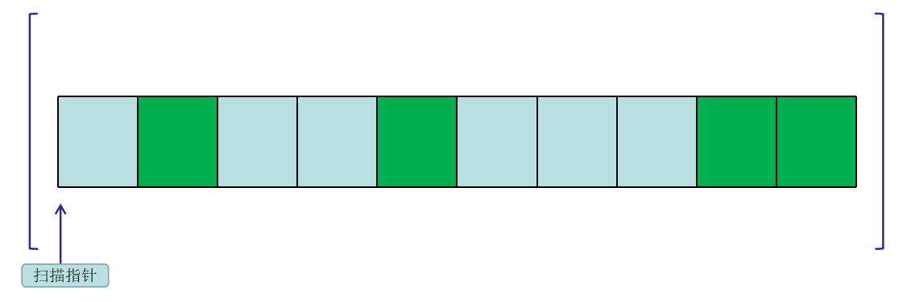

# [Inside HotSpot] Serial垃圾回收器 (一) Full GC

# Serial垃圾回收器Full GC
Serial垃圾回收器的Full GC使用标记-压缩(Mark-Compact)进行垃圾回收，该算法基于Donald E. Knuth提出的Lisp2算法，它会把所有存活对象滑动到空间的一端，所以也叫sliding compact。Full GC始于`gc/serial/tenuredGeneration`的TenuredGeneration::collect，它会在GC前后记录一些日志，真正的标记压缩算法发生在GenMarkSweep::invoke_at_safepoint，我们可以使用`-Xlog:gc*`得到该算法的流程：
```bash
 GC(0) Pause Young (Allocation Failure)
 GC(1) Pause Full (Allocation Failure)
 GC(1) Phase 1: Mark live objects
 GC(1) Phase 1: Mark live objects 1.136ms
 GC(1) Phase 2: Compute new object addresses
 GC(1) Phase 2: Compute new object addresses 0.170ms
 GC(1) Phase 3: Adjust pointers
 GC(1) Phase 3: Adjust pointers 0.435ms
 GC(1) Phase 4: Move objects
 GC(1) Phase 4: Move objects 0.208ms
```
标记-压缩分为四个阶段（如果是fastdebug版jvm，可以使用`-Xlog:gc*=trace`得到更为详细的日志，不过可能详细过头了...），这篇文章将围绕四个阶段展开。

## 1. 阶段1：标记存活对象
第一阶段对应GC日志的`GC(1) Phase 1: Mark live objects`
JVM在`process_string_table_roots()`和`process_roots()`中会遍历所有类型的GC Root，然后使用`XX::oops_do(root_closure)`从该GC Root出发标记所有存活对象。XX表示GC Root类型，root_closure表示**标记存活对象**的方法(闭包)。GC模块有很多闭包(closure)，它们代表的是一段代码、一种行为。root_closure就是一个`MarkSweep::FollowRootClosure`闭包。这个闭包很强大，给它一个对象，就能标记这个对象，迭代标记对象的成员，以及对象所在的栈的所有对象及其成员：
```cpp
// hotspot\share\gc\serial\markSweep.cpp
void MarkSweep::FollowRootClosure::do_oop(oop* p)       { follow_root(p); }

template <class T> inline void MarkSweep::follow_root(T* p) {
  // 如果引用指向的对象不为空且未标记
  T heap_oop = RawAccess<>::oop_load(p);
  if (!CompressedOops::is_null(heap_oop)) {
    oop obj = CompressedOops::decode_not_null(heap_oop);
    if (!obj->mark_raw()->is_marked()) {
      mark_object(obj);   // 标记对象
      follow_object(obj); // 标记对象的成员 
    }
  }
  follow_stack();       // 标记引用所在栈
}
// 如果对象是数组对象则标记数组，否则标记对象的成员
inline void MarkSweep::follow_object(oop obj) {
  if (obj->is_objArray()) {
    MarkSweep::follow_array((objArrayOop)obj);
  } else {
    obj->oop_iterate(&mark_and_push_closure);
  }
}

// 标记引用所在的整个栈
void MarkSweep::follow_stack() {
  do {
    // 如果待标记栈不为空则逐个标记
    while (!_marking_stack.is_empty()) {
      oop obj = _marking_stack.pop();
      follow_object(obj);
    }
    // 如果对象数组栈不为空则逐个标记
    if (!_objarray_stack.is_empty()) {
      ObjArrayTask task = _objarray_stack.pop();
      follow_array_chunk(objArrayOop(task.obj()), task.index());
    }
  } while (!_marking_stack.is_empty() || !_objarray_stack.is_empty());
}

// 标记数组的类型的Class和数组成员，比如String[] p = new String[2]
// 对p标记会同时标记java.lang.Class，p[1],p[2]
inline void MarkSweep::follow_array(objArrayOop array) {
  MarkSweep::follow_klass(array->klass());
  if (array->length() > 0) {
    MarkSweep::push_objarray(array, 0);
  }
}
```


既然走到这里了不如看看JVM是如何标记对象的：
```cpp
inline void MarkSweep::mark_object(oop obj) {
  // 获取对象的mark word
  markOop mark = obj->mark_raw();
  // 设置gc标记
  obj->set_mark_raw(markOopDesc::prototype()->set_marked());
  // 垃圾回收器视情况保留对象的gc标志
  if (mark->must_be_preserved(obj)) {
    preserve_mark(obj, mark);
  }
}
```
对象的mark work有32bits或者64bits，取决于CPU架构和UseCompressedOops：
```js
// hotspot\share\oops\markOop.hpp
32 位mark lword：
  hash:25 ------------>| age:4    biased_lock:1 lock:2 (normal object)
  JavaThread*:23 epoch:2 age:4    biased_lock:1 lock:2 (biased object)
  size:32 ------------------------------------------>| (CMS free block)
  PromotedObject*:29 ---------->| promo_bits:3 ----->| (CMS promoted object)
最后的lock2位有不同含义：
  [ptr             | 00]  locked             ptr指向栈上真正的对象头
  [header      | 0 | 01]  unlocked           普通对象头
  [ptr             | 10]  monitor            膨胀锁
  [ptr             | 11]  marked             GC标记
```
原来垃圾回收标记就是对每个对象mark word最后两位置11，可是如果最后两位用于其他用途怎么办？比如这个对象的最后两位表示膨胀锁，那GC就不能对它进行标记了，所以垃圾回收器还需要视情况在额外区域保留对象的mark word（PreservedMark）。回到之前的话题，GC Root有很多，有的是我们耳熟能详的，有的则是略微少见：

+ 所有已加载的类(`ClassLoaderDataGraph::roots_cld_do`)
+ 所有Java线程当前栈帧的引用和虚拟机内部线程(`Threads::possibly_parallel_oops_do`)
+ JVM内部使用的引用(`Universe::oopds_do`和`SystemDictionary::oops_do`)
+ JNI handles(`JNIHandles::oops_do`)
+ 所有synchronized锁住的对象引用(`ObjectSynchronizer::oops_do`)
+ java.lang.management对象(`Management::oops_do`)
+ JVMTI导出(`JvmtiExport::oops_do`)
+ AOT代码的堆(`AOTLoader::oops_do`)
+ code cache(`CodeCache::blobs_do`)
+ String常量池(`StringTable::oops_do`)

它们都包含可进行标记的引用，会视情况进行单线程标记或者并发标记，JVM会使用CAS(Atomic::cmpxchg)自旋锁等待标记任务。如果任务全部完成，即标记线程和完成计数相等，就结束阻塞。当对象标记完成后jvm还会使用`ref_processor()->process_discovered_references()`对弱引用，软引用，虚引用，final引用（重写了finialize()方法的引用）根据它们的Java语义做特殊处理，不过与算法本身没有太大关系，有兴趣的请自行了解。

## 2. 阶段2：计算对象新地址

计算对象新地址的思想是：从地址空间开始扫描，如果cur_obj指针指向已经GC标记过的对象，则将该对象的新地址设置为compact_top，然后compact_top推进，cur_obj推进，直至cur_obj到达地址空间结束。


计算新地址伪代码如下:
```cpp
// 扫描堆空间
while(cur_obj<space_end){
  if(cur_obj->is_gc_marked()){
    // 如果cur_Obj当前指向已标记过的对象，就计算新的地址
    int object_size += cur_obj->size();
    cur_obj->new_address = compact_top;
    compact_top = cur_obj;
    cur_obj += object_size;
  }else{
    // 否则快速跳过未标记的连续空间
    while(cur_obj<space_end &&!cur_obj->is_gc_marked()){
      cur_obj += cur_obj->size();
    }
  }
}
```
有了上面的认识，对应到HotSpot实现也比较简单了。计算对象新地址的代码位于CompactibleSpace::scan_and_forward:
```cpp
// hotspot\share\gc\shared\space.inline.hpp
template <class SpaceType>
inline void CompactibleSpace::scan_and_forward(SpaceType* space, CompactPoint* cp) {
  ...
  // compact_top为对象新地址的起始
  HeapWord* compact_top = cp->space->compaction_top(); 
  DeadSpacer dead_spacer(space);
  //最后一个标记对象
  HeapWord*  end_of_live = space->bottom(); 
  // 第一个未标记对象
  HeapWord*  first_dead = NULL;

  const intx interval = PrefetchScanIntervalInBytes;

  // 扫描指针
  HeapWord* cur_obj = space->bottom();
  // 扫描终点
  HeapWord* scan_limit = space->scan_limit();
  // 扫描老年代
  while (cur_obj < scan_limit) {
    // 如果cur_obj指向已标记对象
    if (space->scanned_block_is_obj(cur_obj) && oop(cur_obj)->is_gc_marked()) {
      Prefetch::write(cur_obj, interval);
      size_t size = space->scanned_block_size(cur_obj);
      // 给cur_obj指向的对象设置新地址，并前移compact_top
      compact_top = cp->space->forward(oop(cur_obj), size, cp, compact_top);
      // cur_obj指针前移
      cur_obj += size;
      // 修改最后存活对象指针地址
      end_of_live = cur_obj;
    } else {
      // 如果cur_obj指向未标记对象，则获取这片（可能连续包含未标记对象的）空间的大小
      HeapWord* end = cur_obj;
      do {
        Prefetch::write(end, interval);
        end += space->scanned_block_size(end);
      } while (end < scan_limit && (!space->scanned_block_is_obj(end) || !oop(end)->is_gc_marked()));

      // 如果需要减少对象移动频率
      if (cur_obj == compact_top && dead_spacer.insert_deadspace(cur_obj, end)) {
        oop obj = oop(cur_obj);
        compact_top = cp->space->forward(obj, obj->size(), cp, compact_top);
        end_of_live = end;
      } else {
        // 否则跳过未存活对象
        *(HeapWord**)cur_obj = end;
        // 如果first_dead为空则将这片空间设置为第一个未存活对象
        if (first_dead == NULL) {
          first_dead = cur_obj;
        }
      }
      // cur_obj指针快速前移
      cur_obj = end;
    }
  }
  ...
}
```




如果对象需要移动，`cp->space->forward()`会将新地址放入对象的mark word里面。计算对象新地址里面有个小技巧可以参见上图图2，当扫描到连续多个未存活对象的时候，它把第一个未存活对象设置为该片区域结尾的指针，这样下一次扫描到第一个对象可以直接跳到区域尾，节约时间。

## 3. 阶段3：调整对象指针
第二阶段设置了所有对象的新地址，但是没有改变对象的相对地址和GC Root。比如GC Root指向对象A，B，C，这时候A、B、C都有新地址A',B',C'，GC Root应该相应调整为指向A',B',C':


第三阶段就是干这件事的。还记得第一阶段GC Root的标记行为吗？

> JVM在`process_string_table_roots()`和`process_roots()`中会遍历所有类型的GC Root，然后使用`XX::oops_do(root_closure)`从该GC Root出发标记所有存活对象。XX表示GC Root类型，root_closure表示**标记存活对象**的方法（闭包）。

第三阶段和第一阶段一样，只是第一阶段传递的root_closure表示**标记存活对象**的闭包(`FollowRootClosure`)，第三阶段传递的root_closure表示**调整对象指针**的闭包`AdjustPointerClosure`：
```cpp
// hotspot\share\gc\serial\markSweep.inline.hpp
inline void AdjustPointerClosure::do_oop(oop* p)       { do_oop_work(p); }
template <typename T>
void AdjustPointerClosure::do_oop_work(T* p)           { MarkSweep::adjust_pointer(p); }

template <class T> inline void MarkSweep::adjust_pointer(T* p) {
  T heap_oop = RawAccess<>::oop_load(p);
  if (!CompressedOops::is_null(heap_oop)) {
    // 从地址p处得到对象
    oop obj = CompressedOops::decode_not_null(heap_oop);
    // 从对象mark word中得到新对象地址
    oop new_obj = oop(obj->mark_raw()->decode_pointer());
    if (new_obj != NULL) {
      // 将地址p处设置为新对象地址
      RawAccess<IS_NOT_NULL>::oop_store(p, new_obj);
    }
  }
}
```
`AdjustPointerClosure`闭包会遍历所有GC Root然后调整对象指针，注意，这里和第一阶段有个重要不同是第一阶段传递的`FollowRootClosure`闭包会从GC Root出发标记所有可达对象，但是`AdjustPointerClosure`闭包只会标记GC Root出发直接可达的对象，


从对象出发寻找可达其他对象这一步是使用的另一个闭包`GenAdjustPointersClosure`，它会调用CompactibleSpace::scan_and_adjust_pointers遍历整个堆空间然后调整存活对象的指针：
```cpp
//hotspot\share\gc\shared\space.inline.hpp
template <class SpaceType>
inline void CompactibleSpace::scan_and_adjust_pointers(SpaceType* space) {
  // 扫描指针
  HeapWord* cur_obj = space->bottom();
  // 最后一个标记对象
  HeapWord* const end_of_live = space->_end_of_live;
  // 第一个未标记对象
  HeapWord* const first_dead = space->_first_dead; 
  const intx interval = PrefetchScanIntervalInBytes;

  // 扫描老年代
  while (cur_obj < end_of_live) {
    Prefetch::write(cur_obj, interval);
    // 如果扫描指针指向的对象是存活对象
    if (cur_obj < first_dead || oop(cur_obj)->is_gc_marked()) {
      // 调整该对象指针，调整方法和AdjustPointerClosure所用一样
      size_t size = MarkSweep::adjust_pointers(oop(cur_obj));
      size = space->adjust_obj_size(size);
      // 指针前移
      cur_obj += size;
    } else {
      // 否则扫描指针指向未存活对象，设置扫描指针为下一个存活对象，加速前移
      cur_obj = *(HeapWord**)cur_obj;
    }
  }
}
```

## 4. 阶段4：移动对象
第四阶段传递`GenCompactClosure`闭包，该闭包负责对象的移动：


移动的代码位于CompactibleSpace::scan_and_compact：
```cpp
//hotspot\share\gc\shared\space.inline.hpp
template <class SpaceType>
inline void CompactibleSpace::scan_and_compact(SpaceType* space) {
  verify_up_to_first_dead(space);
  // 老年代起始位置
  HeapWord* const bottom = space->bottom();
  // 最后一个标记对象
  HeapWord* const end_of_live = space->_end_of_live;

  // 如果该区域所有对象都存活，或者没有任何对象，或者没有任何存活对象
  // 就不需要进行移动
  if (space->_first_dead == end_of_live && (bottom == end_of_live || !oop(bottom)->is_gc_marked())) {
    clear_empty_region(space);
    return;
  }

  const intx scan_interval = PrefetchScanIntervalInBytes;
  const intx copy_interval = PrefetchCopyIntervalInBytes;

  // 设置扫描指针cur_obj为空间底部
  HeapWord* cur_obj = bottom;
  // 跳到第一个存活的对象
  if (space->_first_dead > cur_obj && !oop(cur_obj)->is_gc_marked()) {
    cur_obj = *(HeapWord**)(space->_first_dead);
  }

  // 从空间开始到最后一个存活对象为截止进行扫描
  while (cur_obj < end_of_live) {
    // 如果cur_obj执行的对象未标记
    if (!oop(cur_obj)->is_gc_marked()) {
      // 扫描指针快速移动至下一个存活的对象（死对象的第一个word
      // 存放了下一个存活对象的地址，这样就可以快速移动）
      cur_obj = *(HeapWord**)cur_obj;
    } else {
      Prefetch::read(cur_obj, scan_interval);

      size_t size = space->obj_size(cur_obj);
      // 获取对象将要被移动到的新地址
      HeapWord* compaction_top = (HeapWord*)oop(cur_obj)->forwardee();
      Prefetch::write(compaction_top, copy_interval);

      // 移动对象，并初始化对象的mark word
      Copy::aligned_conjoint_words(cur_obj, compaction_top, size);
      oop(compaction_top)->init_mark_raw();

      // 扫描指针前移
      cur_obj += size;
    }
  }

  clear_empty_region(space);
}
```
另外值得注意的是Full GC的四个步骤都是针对整个堆的，也就是说新生代的Eden，From survivor， To survivor，老年代全都做了标记压缩操作，而不只是老年代。