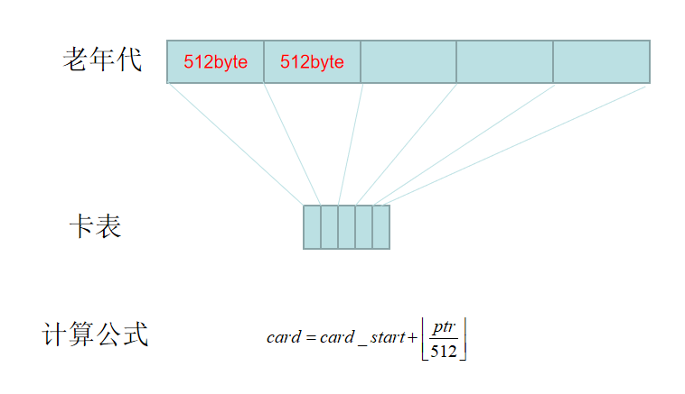
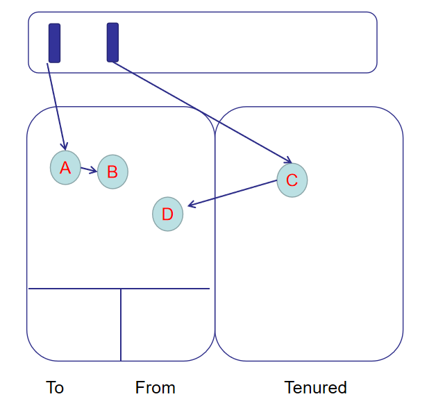
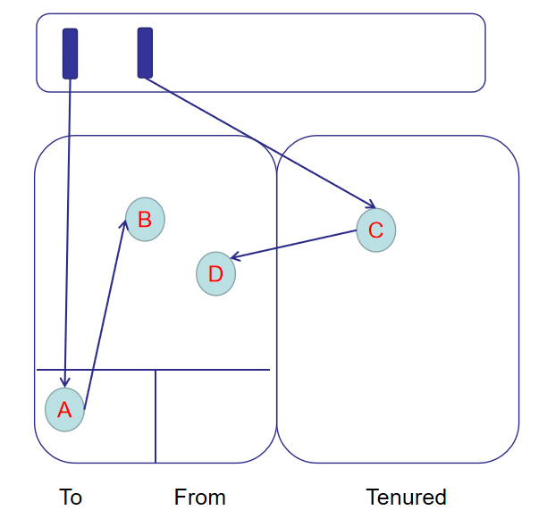
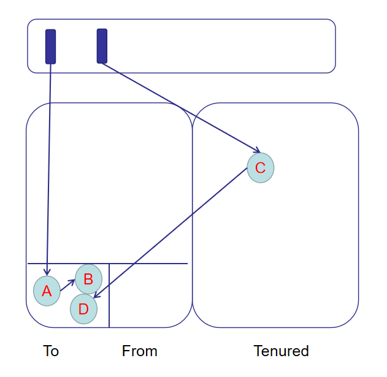

# [Inside HotSpot] Serial垃圾回收器 (二) Minor GC

# Serial垃圾回收器Minor GC
## 1. DefNewGeneration垃圾回收
新生代使用复制算法做垃圾回收，比老年代的标记-压缩简单很多，所有回收代码都位于DefNewGeneration::collect：
```cpp
// hotspot\share\gc\serial\defNewGeneration.cpp
void DefNewGeneration::collect(bool   full,
                               bool   clear_all_soft_refs,
                               size_t size,
                               bool   is_tlab) {
  SerialHeap* heap = SerialHeap::heap();
  _old_gen = heap->old_gen();
  // 如果新生代全是存活对象，老年代可能容不下新生代的晋升
  // 则设置增量垃圾回收失败，直接返回
  if (!collection_attempt_is_safe()) {
    heap->set_incremental_collection_failed(); 
    return;
  }
  ...
  // 各种闭包初始化
  IsAliveClosure is_alive(this);
  ...
  
  {
    // 扫描GC Root，用快速扫描闭包做对象复制
    StrongRootsScope srs(0);
    heap->young_process_roots(&srs,
                              &fsc_with_no_gc_barrier,
                              &fsc_with_gc_barrier,
                              &cld_scan_closure);
  }
  // 用快速成员处理闭包处理非GC Root直达对象
  evacuate_followers.do_void();
  // 特殊处理软引用，弱引用，虚引用，final引用
 ...

  // 如果晋升成功，则清空eden，from；交换from，to分区；调整老年代晋升阈值
  // 同时还需要确保晋升成功的情况下to区一定是空的
  if (!_promotion_failed) {
    eden()->clear(SpaceDecorator::Mangle);
    from()->clear(SpaceDecorator::Mangle);
    if (ZapUnusedHeapArea) {
      to()->mangle_unused_area();
    }
    swap_spaces();
    adjust_desired_tenuring_threshold();
    AdaptiveSizePolicy* size_policy = heap->size_policy();
    size_policy->reset_gc_overhead_limit_count();
  } 
  // 否则晋升失败，提醒老年代
  else {
    _promo_failure_scan_stack.clear(true); 
    remove_forwarding_pointers();
    log_info(gc, promotion)("Promotion failed");
    swap_spaces();
    from()->set_next_compaction_space(to());
    heap->set_incremental_collection_failed();
    _old_gen->promotion_failure_occurred();
  }
  // 更新gc日志，清除preserved mark
  ...
}
```
在做Minor GC之前会检查此次垃圾回收是否安全，所谓**是否安全**是指最坏情况下新生代全是需要晋升的存活对象，这时候老年代能否安全容纳下。如果JVM回答可以做垃圾回收，那么再做下面的展开。

## 2. 快速扫描闭包(FastScanClosure)
新生代的复制动作主要位于young_process_roots(),该函数首先会扫描所有类型的GC Root，使用快速扫描闭包配合GC Root将直达的存活对象复制到To survivor区，然后再扫描从老年代指向新生代的应用。快速扫描闭包指的是`FastScanClosure`，它的代码如下：
```cpp
// hotspot\share\gc\shared\genOopClosures.inline.hpp
inline void FastScanClosure::do_oop(oop* p)       { FastScanClosure::do_oop_work(p); }
template <class T> inline void FastScanClosure::do_oop_work(T* p) {
  // 从地址p处获取对象 
  T heap_oop = RawAccess<>::oop_load(p);
  if (!CompressedOops::is_null(heap_oop)) {
    oop obj = CompressedOops::decode_not_null(heap_oop);
    // 如果对象位于新生代
    if ((HeapWord*)obj < _boundary) {
      // 如果对象有转发指针（相当于已复制过）就保持原位
      // 否则根据情况进行复制
      oop new_obj = obj->is_forwarded() ? obj->forwardee()
                                        : _g->copy_to_survivor_space(obj);
      RawAccess<IS_NOT_NULL>::oop_store(p, new_obj);
      if (is_scanning_a_cld()) {
        do_cld_barrier();
      } else if (_gc_barrier) {
        // 根据情况设置gc barrier
        do_barrier(p);
      }
    }
  }
}
```
一句话总结，快速扫描闭包的能力是**视情况复制地址所指对象或者晋升它**。这段代码有两个值得提及的地方：

1. 根据情况进行复制的copy_to_survivor_space()
2. 根据情况设置gc屏障的do_barrier()

### 2.1 新生代到To survivor的复制
先说第一个复制：
```cpp
// hotspot\share\gc\serial\defNewGeneration.cpp
oop DefNewGeneration::copy_to_survivor_space(oop old) {
  size_t s = old->size();
  oop obj = NULL;
  // 如果对象还年轻就在to区分配空间
  if (old->age() < tenuring_threshold()) {
    obj = (oop) to()->allocate_aligned(s);
  }
  // 如果对象比较老或者to区分配失败，晋升到老年代
  if (obj == NULL) {
    obj = _old_gen->promote(old, s);
    if (obj == NULL) { // 晋升失败处理
      handle_promotion_failure(old);
      return old;
    }
  } else {
    // 如果to分配成功，在新分配的空间里面放入对象
    const intx interval = PrefetchCopyIntervalInBytes;
    Prefetch::write(obj, interval);
    Copy::aligned_disjoint_words((HeapWord*)old, (HeapWord*)obj, s);
    // 对象年龄递增且加入年龄表
    obj->incr_age();
    age_table()->add(obj, s);
  }
  // 把新地址插入对象mark word，表示该对象已经复制过了。
  old->forward_to(obj);
  return obj;
}
```
代码很清晰，如果GC Root里面引用的对象年龄没有超过晋升阈值，就把它从新生代(Eden+From)转移到To,如果超过阈值直接从新生代转移到老年代。

### 2.2 GC屏障
然后说说gc barrier。[之前文章提到](gc_heap_overview.md)过老年代（TenuredGeneration，久任代）继承自卡表代（CardGeneration），卡表代把堆空间划分为一张张512字节的卡片，如果某个卡是脏卡（dirty card）就表示该卡表示的512字节内存空间存在指向新生代的对象，就需要扫描这篇区域。do_barrier()会检查是否开启gc barrier，是否老年代地址p指向的对象存在指向新生代的对象。如果条件都满足就会将卡标记为dirty，那么具体是怎么做的？
```cpp
//hotspot\share\gc\shared\cardTableRS.hpp
class CardTableRS: public CardTable {
  ...
  void inline_write_ref_field_gc(void* field, oop new_val) {
    jbyte* byte = byte_for(field);
    *byte = youngergen_card;
  }
}
```
field表示这个老年代对象的地址，byte_for()会找到该地址对应的card，然后`*byte = youngergen_card`标记为脏卡，再来看看byte_for()又是怎么根据地址找到card的：
```cpp
//hotspot\share\gc\shared\cardTable.hpp
class CardTable: public CHeapObj<mtGC> {
  ...
  jbyte* byte_for(const void* p) const {
    jbyte* result = &_byte_map_base[uintptr_t(p) >> card_shift];
    return result;
  }
}
```
card_shift表示常量9，卡表是一个字节数组，每个字节映射老年代512字节，计算方法就是当前地址除以512向下取整，然后查找卡表数组对应的字节：



## 3. 快速成员处理闭包(FastEvacuateFollowersClosure)
不难看出，快速扫描闭包只是复制和晋升了GC Root直接可达的对象引用。但问题是对象还可能有成员，可达性分析是从GC Root出发寻找对象引用，以及对象成员的引用，对象成员的成员的引用...快速成员处理闭包正是处理剩下不那么直接的对象引用：
```cpp
//hotspot\share\gc\serial\defNewGeneration.cpp
void DefNewGeneration::FastEvacuateFollowersClosure::do_void() {
  do {
    // 对整个堆引用快速成员处理闭包，注意快速扫描闭包是不能单独行动的
    // 他还需要借助快速扫描闭包的力量，因为快速扫描闭包有复制对象的能力
    // _scan_cur_or_nonheap表示快速扫描闭包
    // _scan_older表示带gc屏障的快速扫描闭包
    _heap->oop_since_save_marks_iterate(_scan_cur_or_nonheap, _scan_older);
  } while (!_heap->no_allocs_since_save_marks());
}
```
第一步快速扫描闭包可能会将Eden+From区的对象提升到老年代，这时候如果只处理新生代是不够的，因为这些提升了的对象可能还有新生代的成员域，所以快速成员处理闭包作用的是除了To survivor的整个堆(Eden+From+Tenured)。
```cpp
//hotspot\share\gc\shared\space.inline.hpp
template <typename OopClosureType>
void ContiguousSpace::oop_since_save_marks_iterate(OopClosureType* blk) {
  HeapWord* t;
  // 扫描指针为灰色对象开始
  HeapWord* p = saved_mark_word();
  const intx interval = PrefetchScanIntervalInBytes;
  do {
    // 灰色对象结束
    t = top();
    while (p < t) {
      Prefetch::write(p, interval);
      oop m = oop(p);
      // 迭代处理对象m的成员&&返回对象m的大小
      // 扫描指针向前推进
      p += m->oop_iterate_size(blk);
    }
  } while (t < top());
  set_saved_mark_word(p);
}
```
这里比较坑的是`oop_iterate_size()`函数会同时迭代处理对象m的成员并返回对象m的大小...还要注意oop_iterate_size()传入的blk表示的是快速扫描闭包，同样一句话总结，快速成员处理闭包的能力是**递归式处理一个分区所有对象及对象成员**，这种能力配合上快速扫描闭包最终效果就是将一个分区的对象视情况复制到到To survivor区或者晋升到老年代。

关于快速扫描闭包和快速成员处理闭包用图片说明可能更简单，假设有ABCD四个对象：



当快速扫描闭包完成时A假设会进入To区域：



当快速成员处理闭包完成时A的成员B和老年代C指向的成员D也会进入To：

