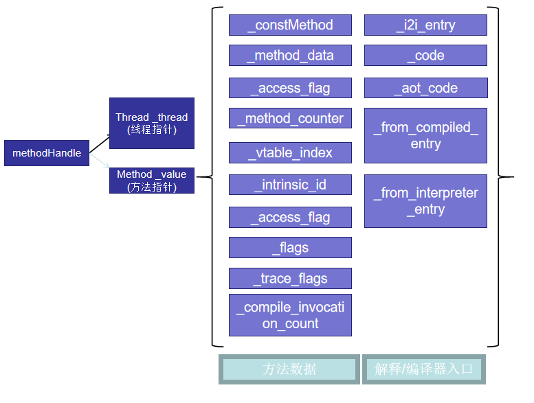
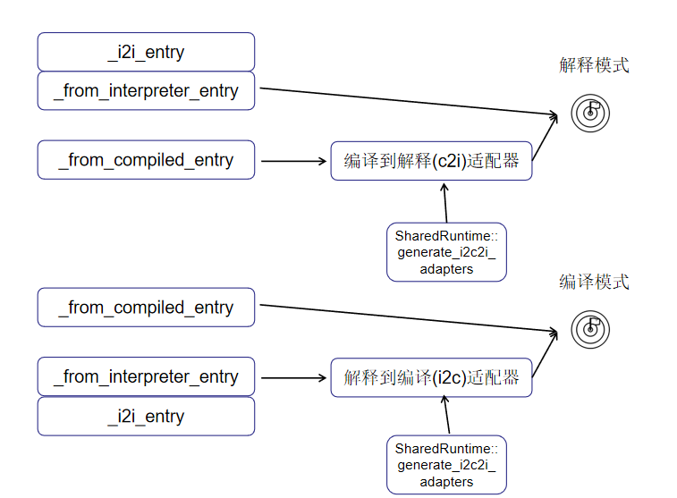
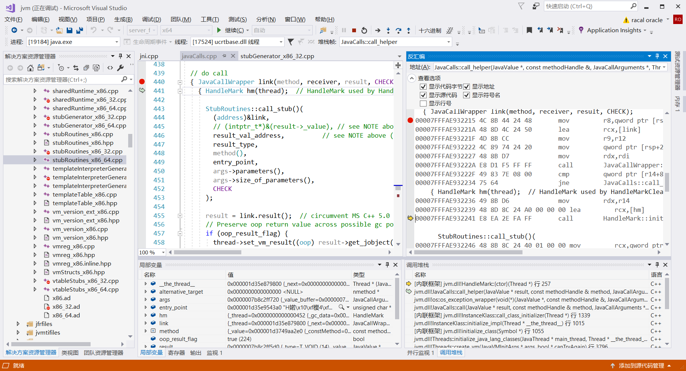
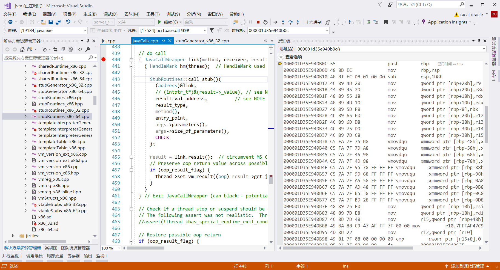
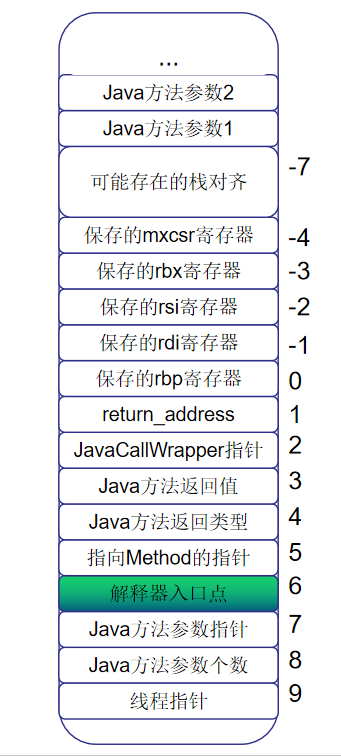

# [Inside HotSpot] Java的方法调用

## 1. 方法调用模块入口
Java所有的方法调用都会经过JavaCalls模块。该模块又细分为call_virtual调用虚函数，call_static调用静态函数等。虚函数调用会根据对象类型进行方法决议，所以需要获取对象引用再查找实际要调用的方法；而静态方法调用直接查找要调用的方法即可。不管怎样，这些方法都是先找到要调用的方法methodHandle，然后传给JavaCalls::call_helper()做实际的调用。

## 2. 寻找调用方法
现在我们知道了methodHandle表示实际要调用的方法，methodHandle里面有一个指向当前线程的指针，还有一个指向`Method`类的指针，`Method`位于`hotspot\share\oops\method.hpp`，各种各样的数据比如方法的访问标志，内联标志，用于编译优化的计数等都落地于此。它的每个属性的意义都是肉眼可见的重要：



### _constMethod
指向方法中一些常量数据，比如**常量池**，max_local，max_stack，返回类型，参数个数，**编译-解释适配器**...这些参数的重要性不言而喻。

### _method_data
存放一些计数信息和Profiling信息，比如方法重编译了多少次，非逃逸参数有多少个，回边有多少，有多少循环和基本块。这些参数会影响后面的编译器优化。

### _method_counters
大量编译优化相关的计数：
+ 解释器调用次数
+ 解释执行时由于异常而终止的次数
+ 方法调用次数（method里面有多少方法调用）
+ 回边个数
+ 该方法曾经过的分层编译的最高层级
+ 热点方法计数

### _access_flag
| flag | 值 | 说明 |
| :---: | :---: | :---: |
| ACC_PUBLIC | 0x0001 | 方法是否为public |
| ACC_PRIVATE | 0x0002 | 方法是否为private |
| ACC_PROTECTED | 0x0004 | 方法是否为protected |
| ACC_STATIC | 0x0008 | 方法是否为static |
| ACC_FINAL | 0x0010 | 方法是否不可重写 |
| ACC_SYNCHRONIZED | 0x0020 | 是否存在方法锁 |
| ACC_BRIDGE | 0x0040 | 该方法是否由编译器生成|
| ACC_VARARGS | 0x0080 | 是否存在可变参数 |
| ACC_NATIVE | 0x0100 | 是否为native方法 |
| ACC_ABSTRACT | 0x0400 | 是否为抽象方法 |
| ACC_STRICT | 0x0800 | 是否启用严格浮点模式 |
| ACC_SYNTHETIC | 0x1000 | 是否是源代码里面不存在的合成方法 |

### _vtable_index
| flag | 值 | 说明 |
| :---: | :---: | :---: |
| itable_index_max | -10 | 首个itable索引 |
| pending_itable_index    | -9 | itable将会被赋值 |
| invalid_vtable_index    | -4 | 无效虚表index |
| garbage_vtable_index    | -3 | 还没有初始化vtable的方法，垃圾值 |
| nonvirtual_vtable_index | -2 |  不需要虚函数派发，比如static函数就是这种 |

### _flags
这个_flag不同于前面的_access_flag,它是表示这个方法具有什么特征，比如是否强制内联，是否有[@CallerSentitive](https://stackoverflow.com/questions/22626808/what-does-the-sun-reflect-callersensitive-annotation-mean)注解，是否是有[@HotSpotIntrinsicCandidate](https://bugs.openjdk.java.net/browse/JDK-8076112?page=com.atlassian.jira.plugin.system.issuetabpanels:all-tabpanel)注解等

### _intrinsic_id
固有方法(intrinsic method)在虚拟机中表示一些众所周知的方法，针对它们可以做特设处理，生成独特的代码例程，虚拟机发现一个方法是固有方法就不会走逐行解释字节码这条路径而是跳到独特的代码例程上面，所有的固有方法都定义在`hotspot\share\classfile\vmSymbols.hpp`中，有兴趣的可以去看看。

### _compiled_invocation_count
编译后的方法叫nmethod，这个就是用来计数编译后的nmethod调用了多少次，如果该方法是解释执行就为0。

### _code
指向编译后的本地代码。

### _from_interpreter_entry
解释器入口，这个非常重要。之前提到JavaCalls::call得到methodHandle传给call_helper做实际调用，call_helper会使用这个入口进入解释器的世界。

### _from_compiled_entry
如果该方法已经经过了编译，那么就会使用该入口执行编译后的代码。

虚拟机是解释编译混合执行的模型，一个方法可能A时刻是解释模式，B时刻是编译模式，这就要求两个入口都能进入正确的地方。hotspot使用一个**适配器**完成解释编译模式的切换:



之所以要加一个适配器是因为编译产出的本地代码用寄存器存放参数，解释器用栈存放参数，适配器可以消除这些不同，同时正确设置入口点。


## 3. 建立栈帧
前面说道找到methodHandle后传给call_helper做调用。其实，严格来说，call_helper还没有做**方法调用**，它只是检查了下方法是否需要进行编译，验证了参数等等，最终它是调用函数指针`_call_stub_entry`，把方法调用这件事又转交给了_call_stub_entry。
```cpp
// hotspot\share\runtime\javaCalls.cpp
void JavaCalls::call_helper(JavaValue* result, const methodHandle& method, JavaCallArguments* args, TRAPS) {
  ...
  // 调用函数指针_call_stub_entry，把实际的函数调用工作转交给它。
  { JavaCallWrapper link(method, receiver, result, CHECK);
    { HandleMark hm(thread);  // HandleMark used by HandleMarkCleaner
      StubRoutines::call_stub()(
        (address)&link,
        result_val_address,      
        result_type,
        method(),
        entry_point,
        args->parameters(),
        args->size_of_parameters(),
        CHECK
      );

      result = link.result();  
      if (oop_result_flag) {
        thread->set_vm_result((oop) result->get_jobject());
      }
    }
  } 
}
```
_call_stub_entry由generate_call_stub()生成，当调用Java方法前需要建立栈帧，该栈帧就是于此建立的。
另外`StubRoutines::call_stub()()`是将_call_stub_entry强制类型转换为指针然后执行，调试的时候不能对应源码。如果使用Microsoft Visual Studio系列编译器，点击菜单栏`调试->窗口->反汇编`：



然后在反汇编窗口STEP INTO进入`call`：



在右方可以看到generate_call_stub()生成的机器码（的汇编表示）了。由于generate_call_stub太多，这里就不逐行对照，请自行对应源码和反汇编窗口的输出，generate_call_stub里面是用汇编形式写的机器码生成，全部贴出来既无必要也没意思，所以用注释代替了，只保留最重要的逻辑：
```cpp
// hotspot\cpu\x86\stubGenerator_x86_32.cpp
address generate_call_stub(address& return_address) {
    // 保存重要的参数比如解释器入口点，Java方法返回地址等
    // 将Java方法的参数压入栈

    // 调用Java方法
    __ movptr(rbx, method);           // 将Method*指针存放到rbx
    __ movptr(rax, entry_point);      // 将解释器入口存放到rax
    __ mov(rsi, rsp);                 // 将当前栈顶存放到rsi
    __ call(rax);                     // 进入解释器入口！

    // 处理Java方法返回值
    // 弹出Java参数
    // 返回
    return start;
  }
```
它首先建立了一个栈帧，这个栈帧里面保存了一些重要的数据，再把Java方法的参数压入栈，当这一步完成，栈帧变成了这个样子：



## 4. Java方法调用
当栈帧建立完毕就可以调用Java方法了。重复一次，Java方法调用使用如下代码：
```cpp
    // 调用Java方法
    __ movptr(rbx, method);           // 将Method*指针存放到rbx
    __ movptr(rax, entry_point);      // 将解释器入口存放到rax
    __ mov(rsi, rsp);                 // 将当前栈顶存放到rsi
    __ call(rax);                     // 进入解释器入口！
```
前面三句将重要的数据放入寄存器，然后`call rax`相当于`call entry_point`，这个entry_point即解释器入口点，最终的方法执行过程其实是在这里面的，_call_stub_entry只是一个桩代码(Stub code)，创建了栈帧，处理调用返回，实际的调用还是要跳到解释器里面的。

[桩代码](https://en.wikipedia.org/wiki/Method_stub)的意义有很多，常见的就是它是一个符合要求的签名的函数，但是函数现在还没有完全实现，那就留一个桩占位。比如一个系统需要读取外部温度：
```cpp
void work(){
  float temperature = readTemperatureFromSensor();
  if(temperature>40.0){
    ...
  }
}
float readTemperatureFromSensor(){
  return 42.0f;
}
```
这个读温度的函数比较复杂，涉及传感器的硬件编程，现阶段我们只想完成外部即work的逻辑，那么就将readTemperatureFromSensor()做为一个stub，写一个假的实现，后面再补全。

回到主题，虚拟机_call_stub_entry桩代码的意思是它不完成具体任务（方法调用），只是做一些辅助工作（建立栈帧），而是跳到（call rax）解释器入口完成具体任务，虚拟机中还有很多这样的模式，其它叫法还有trampoline（跳床），以后都会遇到。

## 5. 总结
学而不思则罔，思而不学则殆。我们大概清楚了Java方法调用的流程，现在可以试着来总结一下：
JavaCalls里面的`call_static()`或者`call_virtual`通过方法决议找到要调用的方法methodHandle，传递给JavaCalls::call()；JavaCalls::call()做一些简单的检查，比如方法是否需要进行C1/C2 JIT，参数对不对，之后调用_call_stub_entry，它会建立栈帧，进入解释器执行字节码，最后从解释器返回，处理返回值，完成方法调用。详细的调用栈如下：
```cpp
JavaCalls::call_static()          // 找到要调用的方法
  -> JavaCalls::call()               
    -> os::os_exception_wrapper()
      -> JavaCalls::call_helper()
        -> _call_stub_entry()     // 建立栈帧，处理解释器返回值
          -> `call rbx`           // 进入解释器入口点
```


## 附录1. 使用hsdis查看对应的汇编表示 
如果觉得上述调试方法过于麻烦，还有备选方案。下载[hsdis-amd64.dll](https://files.cnblogs.com/files/kelthuzadx/hsdis-amd64.zip)，将它放在`jdk/bin/server/`目录下，然后虚拟机加上参数`-XX:+UnlockDiagnosticVMOptions -XX:+PrintStubCode`还可以查看上面的生成的机器代码的汇编形式，不过除了验证比对外一般人也很难从这大段汇编中看出什么...：
```asm
StubRoutines::call_stub [0x000001a53eb80b0c, 0x000001a53eb80efe[ (1010 bytes)
  0x000001a53eb80b0c: push   %rbp
  0x000001a53eb80b0d: mov    %rsp,%rbp
  0x000001a53eb80b10: sub    $0x1d8,%rsp
  0x000001a53eb80b17: mov    %r9,0x28(%rbp)
  0x000001a53eb80b1b: mov    %r8d,0x20(%rbp)
  0x000001a53eb80b1f: mov    %rdx,0x18(%rbp)
  0x000001a53eb80b23: mov    %rcx,0x10(%rbp)
  0x000001a53eb80b27: mov    %rbx,-0x8(%rbp)
  0x000001a53eb80b2b: mov    %r12,-0x20(%rbp)
  0x000001a53eb80b2f: mov    %r13,-0x28(%rbp)
  0x000001a53eb80b33: mov    %r14,-0x30(%rbp)
  0x000001a53eb80b37: mov    %r15,-0x38(%rbp)
  0x000001a53eb80b3b: vmovdqu %xmm6,-0x48(%rbp)
  0x000001a53eb80b40: vmovdqu %xmm7,-0x58(%rbp)
  0x000001a53eb80b45: vmovdqu %xmm8,-0x68(%rbp)
  0x000001a53eb80b4a: vmovdqu %xmm9,-0x78(%rbp)
  0x000001a53eb80b4f: vmovdqu %xmm10,-0x88(%rbp)
  0x000001a53eb80b57: vmovdqu %xmm11,-0x98(%rbp)
  0x000001a53eb80b5f: vmovdqu %xmm12,-0xa8(%rbp)
  0x000001a53eb80b67: vmovdqu %xmm13,-0xb8(%rbp)
  0x000001a53eb80b6f: vmovdqu %xmm14,-0xc8(%rbp)
  0x000001a53eb80b77: vmovdqu %xmm15,-0xd8(%rbp)
 ; 省略500+行
```

## 附录2. 解释器入口点
意犹未尽吗？上面省略了很多东西，比如**进入解释器入口点执行字节码**这个重要的事情。那么解释器入口点在哪？我们知道[解释器是在虚拟机创建的时候JIT生成的](https://www.cnblogs.com/kelthuzadx/p/10707504.html)，可以跟踪虚拟机创建找到它，它的调用栈如下：
```cpp
Threads::create_vm()
  -> init_globals() 
    -> interpreter_init()()
      -> TemplateInterpreter::initialize()
        -> TemplateInterpreterGenerator()   // 构造函数
          -> TemplateInterpreterGenerator::generate_all()
            -> TemplateInterpreterGenerator::generate_normal_entry()
```
普通方法（非synchronized，非native）的解释器入口点是通过`\hotspot\cpu\x86\templateInterpreterGenerator_x86.cpp`中的generate_normal_entry()生成的。

## 附录3. 设置解释器入口点
还是这个问题，我们知道了解释器入口点在哪，但是这个解释器入口点又是怎么和方法关联起来的呢？

Java的类在虚拟机中会经过**加载** -> **链接** -> **初始化** 三个步骤，网上有很多详细解释这里就不在赘述。具体来说`instanceKlass`在虚拟机中表示一个Java类，它使用`instanceKlass::link_class()`做链接过程。类的链接会触发类中方法的`Method::link_method()`，它会给方法设置正确的解释器入口点，编译器适配器等：
```cpp
// hotspot\share\oops\method.cpp
void Method::link_method(const methodHandle& h_method, TRAPS) {
  ... 
  if (!is_shared()) {
    // entry_for_method会找到刚刚generate_normal_entry设置的入口点
    address entry = Interpreter::entry_for_method(h_method);
    // 将它设置为解释器入口点，即可_i2i_entry和_from_interpreted_entry
    set_interpreter_entry(entry);
  }
  ...
  // 设置_from_compiled_entry的适配器
  (void) make_adapters(h_method, CHECK);
}
```


