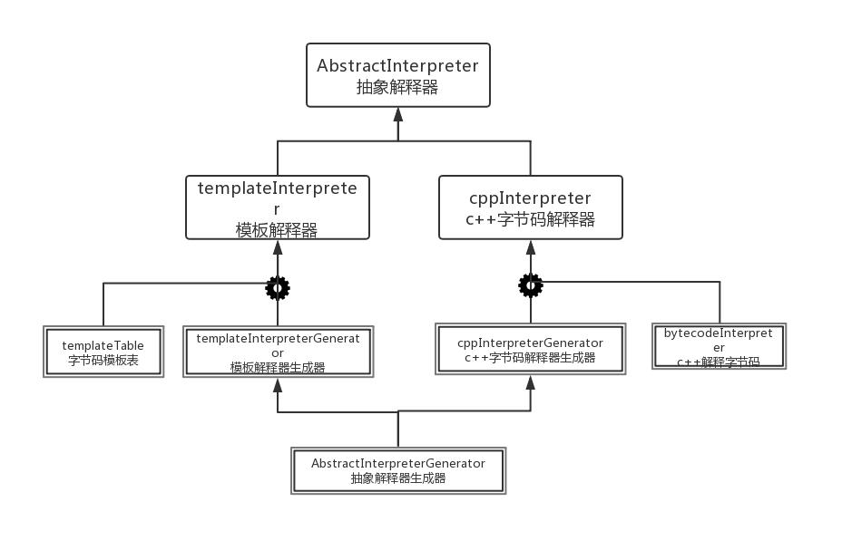

# [Inside HotSpot] 模板解释器
## 0. 简介
众所周知，hotspot默认使用`解释+编译混合`(-Xmixed)的方式执行代码。它首先使用模板解释器对字节码进行解释，当发现一段代码是热点的时候，就使用C1/C2 JIT进行优化编译再执行，这也它的名字"热点"(hotspot)的由来。

解释器的代码位于`hotspot/share/interpreter`，它的总体架构如下：




## 1. 解释器的两种实现
首先hotspot有一个**C++字节码解释器**，还有一个**模板解释器** ，默认使用的是模板解释器的实现。这两个有什么区别呢？举个例子，Java字节码有`istore_0`，`iadd`，如果是C++字节码解释器（图右部分），那么它的工作流程就是这种：
```cpp
void cppInterpreter::work(){
    for(int i=0;i<bytecode.length();i++){
        switch(bytecode[i]){
            case ISTORE_0:
                int value = operandStack.pop();
                localVar[0] = value;
                break;
            case IADD:
                int v1 = operandStack.pop();
                int v2 = operandStack.pop();
                int res = v1+v2;
                operandStack.push(res);
                break;
            ....
        }
    }
}
```
它使用C++语言模拟字节码的执行，iadd是两个数相加，字节码解释器从栈上pop两个数据然后求和，再push到栈上。

如果是模板解释器就完全不一样了。模板解释器是一堆本地码的例程(routines)，它会在虚拟机创建的时候初始化好，也就是说，模板解释器在初始化的时候会申请一片内存并设置为可读可写可执行，然后向那片内存写入本地码。在解释执行的时候遇到iadd，就执行那片内存里面的二进制代码。

这种运行时代码生成的机制可以说是JIT，只是通常意义的JIT是指对一块代码进行优化再生成本地代码，同一段代码可能因为分成编译产出不同的本地码，具有动态性；而模板解释器是虚拟机在创建的时候JIT生成它自身，它的每个例程比如异常处理部分，安全点处理部分的本地码都是固定的，是静态的。


## 2. 解释器
### 2.1 抽象解释器
再回到主题，架构图有一个抽象解释器,这个抽象解释器描述了解释器的基本骨架，它的属性如下：
```cpp
class AbstractInterpreter{
StubQueue* _code                      
address    _slow_signature_handler;
address    _entry_table[n];         
address    _cds_entry_table[n];
 ...
}; 
```
所有的解释器(C++字节码解释器，模板解释器)都有这些例程和属性，然后子类的解释器还可以再扩展一些例程。

我们重点关注`_code`，它是一个队列，


队列中的**InterpreterCodelet**表示一个小例程，比如iconst_1对应的代码，invokedynamic对应的代码，异常处理对应的代码，方法入口点对应的代码，这些代码都是一个个InterpreterCodelet...整个解释器都是由这些小块代码例程组成的，每个小块例程完成解释器的部分功能，以此实现整个解释器。

`_entry_table`也是个重要的属性，这个数组表示方法的例程，比如普通方法是入口点1`_entry_table[0]`,带synchronized的方法是入口点2`_entry_table[1]`，这些`_entry_table[0],_entry_table[1]`指向的就是之前_code队列里面的小块例程，就像这样：
```cpp
_entry_table[0] = _code->get_stub("iconst_1")->get_address();
_entry_table[1] = _code->get_stub("fconst_1")->get_address();
```
当然实际的实现远比伪代码复杂。

### 2.2 模板解释器
前面说道小块例程组合起来实现了解释器，抽象解释器定义了必要的例程，具体的解释器在这之上还有自己的特设的例程。模板解释器就是一个例子，它继承自抽象解释器，在那些例程之上还有自己的特设例程：
```cpp
  // 数组越界异常例程
  static address    _throw_ArrayIndexOutOfBoundsException_entry;    
  // 数组存储异常例程    
  static address    _throw_ArrayStoreException_entry;  
  // 算术异常例程
  static address    _throw_ArithmeticException_entry;
  // 类型转换异常例程
  static address    _throw_ClassCastException_entry;
  // 空指针异常例程
  static address    _throw_NullPointerException_entry;
  // 抛异常公共例程
  static address    _throw_exception_entry;             
```
这样做的好处是可以针对一些特殊例程进行特殊处理，同时还可以复用代码。

到这里**解释器的布局**应该是说清楚了，我们大概知道了：解释器是一堆本地代码例程构造的，这些例程会在虚拟机启动的时候写入，以后解释就只需要进入指定例程即可。

## 3. 解释器生成器
### 3.1 生成器与解释器的关系
还有一个问题，这些例程是谁写入的呢？找一找架构图，下半部分都是**解释器生成器**，它的名字也是自解释的，那么它就是答案了。
前面刻意说道解释器布局就是想突出它只是一个骨架，要得到可运行的解释器还需要解释器生成器填充这个骨架。

解释器生成器本来可以独自完成填充工作，可能为了解耦，也可能是为了结构清晰，hotspot将字节码的例程抽了出来放到了templateTable(模板表)中，它辅助模板解释器生成器(templateInterpreterGenerator)完成各例程填充。

只有这两个还不能完成任务，因为组成模板解释器的是本地代码例程，本地代码例程依赖于操作系统和CPU，这部分代码位于`hotspot/cpu/x86/`中，所以
```cpp
templateInterpreter = 
    templateTable + 
    templateTable_x86 +
    templateInterpreterGenerator + 
    templateInterpreterGenerator_x86 +
    templateInterpreterGenerator_x86_64
```
虚拟机中有很多这样的设计：在`hotspot/share/`的某个头文件写出定义，在源文件实现OS/CPU无关的代码，然后在`hotspot/cpu/x86`中实现CPU相关的代码，在`hostpot/os`实现OS相关的代码。

### 3.2 示例：数组越界异常例程生成
这么说可能有些苍白无力，还是结合代码更具说服力。
模板解释器扩展了抽象解释器，它有一个数组越界异常例程：
```cpp
// 解释器生成器
// hotspot\share\interpreter\templateInterpreterGenerator.cpp
void TemplateInterpreterGenerator::generate_all() {
    ...
  { CodeletMark cm(_masm, "throw exception entrypoints");
    // 调用CPU相关的代码生成例程
    Interpreter::_throw_ArrayIndexOutOfBoundsException_entry = generate_ArrayIndexOutOfBounds_handler();
  }
  ...
}
// 解释器生成器中CPU相关的部分
// hotspot\os\x86\templateInterpreterGenerator_x86.cpp
address TemplateInterpreterGenerator::generate_ArrayIndexOutOfBounds_handler() {
  address entry = __ pc();
  __ empty_expression_stack();
  // rarg是数组越界的对象，rbx是越界的索引
  Register rarg = NOT_LP64(rax) LP64_ONLY(c_rarg1);
  __ call_VM(noreg,
             CAST_FROM_FN_PTR(address,
                              InterpreterRuntime::
                              throw_ArrayIndexOutOfBoundsException),
             rarg, rbx);
  return entry;
}
// 解释器运行时
// hotspot\share\interpreter\interpreterRuntime.cpp
IRT_ENTRY(void, InterpreterRuntime::throw_ArrayIndexOutOfBoundsException(JavaThread* thread, arrayOopDesc* a, jint index))
  ResourceMark rm(thread);
  stringStream ss;
  ss.print("Index %d out of bounds for length %d", index, a->length());
  THROW_MSG(vmSymbols::java_lang_ArrayIndexOutOfBoundsException(), ss.as_string());
IRT_END
```
解释器生成器会调用CPU相关的generate_ArrayIndexOutOfBounds_handler()生成异常处理例程，里面有个`call_VM`，它调用了**解释器运行时**(InterpreterRuntime)来处理异常。解释器运行时是C++代码，
之所以用它是因为异常处理比较麻烦，还需要C++其他模块的支持（比如这里的stringStream和THROW_MSG），直接生成机器码会非常麻烦，我们可以调用解释器运行时相对轻松的处理。

我们在后面还会经常遇到`call_VM`调用解释器运行时这种模式，如果有很复杂的任务，需要其他C++模块的支持，那么它就派上用场了。


